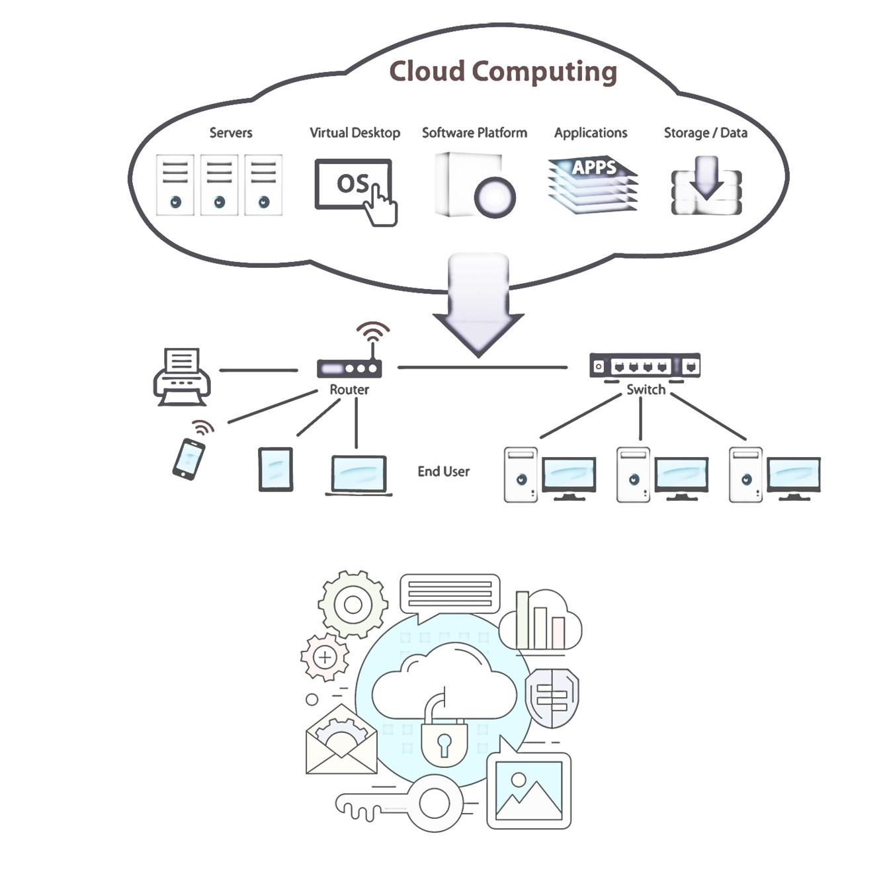

Deploying Virtual Machines on Digital Ocean: VPS Server Setup

Master VPS Server Deployment on Digital Ocean: Comprehensive Guide to Cloud Management and Virtual Machine Setup

Tips/Tricks/Notes/Commands URL Link >> https://github.com/nimaxnimax/Udemy_Virtualization

Instructor & Courses >> https://www.udemy.com/user/adrian-fischer-infotech/

Welcome to "Deploying Virtual Machines on Digital Ocean: VPS Server Setup." This comprehensive course is designed to equip you with the skills and knowledge needed to effectively create and manage virtual private servers (VPS) using Digital Ocean's powerful cloud infrastructure. Through a blend of theoretical concepts and practical exercises, you'll learn how to harness the full potential of virtual machines, customize server configurations, and optimize cloud management for enhanced performance and security. Whether you're a developer, IT professional, or a cloud enthusiast, this course will guide you through the essentials of VPS deployment and management, empowering you to leverage Digital Ocean’s robust and scalable solutions for your projects.

#### Course Description:

In this course, you will learn how to create and manage virtual machines on Digital Ocean, a leading cloud infrastructure provider. We will cover the fundamentals of virtual machines, including their purpose, functionality, and benefits. You will gain practical knowledge on deploying VPS servers on Digital Ocean, leveraging its robust and scalable cloud infrastructure.

**Virtual Machines (VMs):** VMs allow you to run multiple operating systems on a single physical machine, providing flexibility, cost-efficiency, and isolation of applications. They are essential for optimizing resources and enhancing system performance.

**Digital Ocean:** Known for its simplicity and powerful features, Digital Ocean offers a user-friendly interface and reliable cloud services. It is ideal for developers, startups, and enterprises seeking scalable and affordable cloud solutions.

**Advantages of Digital Ocean Cloud:**
- **Scalability:** Easily scale your applications to meet increasing demands.
- **Cost-Effective:** Pay only for the resources you use with predictable pricing.
- **High Performance:** Experience fast and reliable infrastructure with SSD storage and a global network.
- **User-Friendly:** Simplified management with an intuitive control panel and API.

**Why Cloud Management is Important:** Effective cloud management ensures optimal use of resources, enhances security, and reduces operational costs. It allows you to monitor performance, automate processes, and maintain compliance with industry standards.

**Why Use VPS (Virtual Private Server):**
- **Resource Control:** Dedicated resources for your applications without the need for a physical server.
- **Security:** Enhanced security with isolated environments for each VPS.
- **Customization:** Full control over the server environment, allowing custom configurations and installations.
- **Reliability:** High uptime and stability with dedicated resources.

Join this course to master the deployment and management of virtual machines on Digital Ocean, and take your cloud management skills to the next level.

### What Will Students Learn in This Course

- **Introduction to Virtual Machines and Cloud Computing**
  - Understand the basics of virtual machines and their benefits.
  - Learn about cloud computing and its advantages.

- **Getting Started with Digital Ocean**
  - Create and set up a Digital Ocean account.
  - Navigate the Digital Ocean dashboard and interface.

- **Creating Virtual Private Servers (VPS)**
  - Step-by-step guide to creating VPS instances on Digital Ocean.
  - Understand different types of droplets and their use cases.

- **Configuring VPS Options**
  - Customize VPS configurations to meet specific requirements.
  - Learn about CPU, RAM, storage, and networking options.
  - Configure SSH keys for secure access.

- **Server Deployment and Management**
  - Deploy servers and install necessary software.
  - Set up and manage databases, web servers, and other services.
  - Monitor server performance and manage resources.

- **Cloud Management Best Practices**
  - Implement security measures and backups.
  - Automate tasks and streamline cloud management.
  - Optimize cost and performance through effective cloud management.

- **Advanced Digital Ocean Features**
  - Utilize Digital Ocean’s API for automation.
  - Explore additional services like managed databases and Kubernetes.

By the end of this course, students will have the skills to effectively create, configure, and manage virtual private servers on Digital Ocean, ensuring efficient and secure cloud management.

### Prerequisites and Basic Requirements

Before taking this course, students should have a basic understanding of computer science and familiarity with operating systems. Knowledge of networking fundamentals and basic command-line skills are essential. Experience with web development or system administration will be beneficial but not required. Additionally, students will need a computer with internet access and a valid credit card to set up a Digital Ocean account for practical exercises.

### Who Should Learn This Course

This course is ideal for developers, system administrators, IT professionals, and anyone interested in cloud computing and server management. It is particularly beneficial for those looking to gain practical experience in deploying and managing virtual private servers on Digital Ocean. Whether you are a beginner aiming to understand the basics of VPS and cloud management or an experienced professional seeking to enhance your skills with Digital Ocean’s platform, this course will provide valuable insights and hands-on experience.

### Why Deploy VMs or VPS on Cloud and Digital Ocean

#### Why Deploy VMs or VPS on the Cloud:
- **Flexibility:** Easily scale your infrastructure up or down based on current needs, ensuring efficient use of resources.
- **Cost Efficiency:** Only pay for the resources you use, eliminating the need for significant upfront investment in hardware.
- **Accessibility:** Access your servers and applications from anywhere with an internet connection, facilitating remote work and global collaboration.
- **Reliability:** Benefit from the high availability and redundancy provided by cloud providers, reducing the risk of downtime.
- **Security:** Cloud providers implement robust security measures and compliance standards, offering enhanced data protection and privacy.

#### Advantages of Deploying on Digital Ocean:
- **User-Friendly Interface:** Digital Ocean offers an intuitive control panel and simple management tools, making it easy for users of all skill levels to deploy and manage VMs and VPS.
- **Scalability:** Seamlessly scale your applications and resources to handle increased traffic or workloads.
- **Cost-Effective:** Digital Ocean provides transparent and predictable pricing, allowing you to manage costs effectively.
- **Performance:** Benefit from high-performance SSD storage and a global network of data centers, ensuring fast and reliable access to your applications.
- **Developer-Friendly:** Digital Ocean offers extensive documentation, a robust API, and various pre-configured one-click applications, streamlining the deployment and management process.
- **Community and Support:** Access a vibrant community of developers and comprehensive support resources to help resolve any issues or questions.

Deploying VMs or VPS on Digital Ocean combines the advantages of cloud computing with a powerful, user-friendly platform, enabling efficient and effective management of your infrastructure.

### Introduction to Virtual Machines and Cloud Computing

#### What is a Virtual Machine (VM) and Why Use It?
- **What is a VM:**
  - A virtual machine (VM) is a software-based emulation of a physical computer, allowing you to run multiple operating systems on a single physical machine.
- **Why Use a VM:**
  - Flexibility: Run different operating systems and applications on the same hardware.
  - Resource Optimization: Efficiently utilize hardware resources by sharing them among multiple VMs.
  - Isolation: Each VM operates independently, providing a secure environment for applications.
  - Ease of Testing and Development: Quickly create, clone, and delete VMs to test software in different environments.

#### Benefits of Virtual Machines:
- Improved resource utilization and cost-efficiency.
- Enhanced system performance and application management.
- Simplified backup and disaster recovery processes.
- Easy migration and scaling of applications.
- Increased flexibility for development and testing.

#### What is Cloud Computing and Why Use It?
- **What is Cloud Computing:**
  - Cloud computing is the delivery of computing services, including servers, storage, databases, networking, software, and analytics, over the internet ("the cloud").
- **Why Use Cloud Computing:**
  - On-Demand Resources: Access computing resources as needed without upfront investments.
  - Scalability: Scale resources up or down based on demand, ensuring optimal performance.
  - Cost Savings: Reduce capital expenditures and operational costs with a pay-as-you-go model.
  - Disaster Recovery: Enhanced data backup and disaster recovery solutions.
  - Collaboration: Facilitate collaboration and access from any location with an internet connection.

#### Advantages of Cloud Computing:
- **Scalability:** Easily adjust resources to meet changing needs.
- **Cost-Effectiveness:** Pay only for what you use, reducing overall IT costs.
- **Performance:** Benefit from high-performance infrastructure with global reach.
- **Reliability:** Enjoy high availability and robust disaster recovery options.
- **Accessibility:** Access applications and data from anywhere, facilitating remote work and collaboration.

### Digital Ocean Products Overview

#### 1. Droplets
- **Description:** Virtual private servers (VPS) that run on Digital Ocean’s cloud infrastructure.
- **Use Case:** Hosting websites, applications, databases, and other services.
- **Features:** Easy setup, scalable, and available in different configurations to meet various needs.

#### 2. Kubernetes
- **Description:** Managed Kubernetes service for deploying, managing, and scaling containerized applications.
- **Use Case:** Automating deployment, scaling, and management of containerized applications.
- **Features:** Simplified cluster management, integrated monitoring, and scalable infrastructure.

#### 3. CPU-Optimized Droplets
- **Description:** Droplets designed for compute-intensive tasks, providing dedicated vCPUs.
- **Use Case:** High-performance computing, data analysis, machine learning, and video encoding.
- **Features:** Consistent performance, optimized for CPU-bound applications.

#### 4. Functions
- **Description:** Serverless computing platform to run event-driven code without managing infrastructure.
- **Use Case:** Building microservices, automating workflows, and running background tasks.
- **Features:** Automatic scaling, pay-per-use pricing, and easy integration with other services.

#### 5. App Platform
- **Description:** Platform-as-a-Service (PaaS) for building, deploying, and scaling web applications.
- **Use Case:** Simplifying app deployment and scaling without managing underlying infrastructure.
- **Features:** Supports various languages and frameworks, automatic scaling, and managed infrastructure.

#### 6. Virtual Private Cloud (VPC)
- **Description:** Isolated network environment for securely connecting and managing Digital Ocean resources.
- **Use Case:** Enhanced security, organization, and management of cloud resources.
- **Features:** Private IP space, custom subnets, and traffic isolation.

#### 7. Cloud Firewall
- **Description:** Network security tool to control inbound and outbound traffic for your resources.
- **Use Case:** Protecting applications and services from unauthorized access.
- **Features:** Easy-to-configure rules, stateful firewall, and free to use.

#### 8. Load Balancer
- **Description:** Distributes incoming traffic across multiple droplets to ensure high availability and reliability.
- **Use Case:** Scaling applications and improving fault tolerance.
- **Features:** Automatic failover, SSL termination, and health checks.

#### 9. Domain DNS
- **Description:** Domain management service for configuring and managing DNS settings.
- **Use Case:** Hosting and managing domain names and DNS records.
- **Features:** Easy DNS setup, reliable and fast resolution, and free to use.

#### 10. DDoS Protection
- **Description:** Security service to protect applications from Distributed Denial of Service (DDoS) attacks.
- **Use Case:** Ensuring availability and performance during attack attempts.
- **Features:** Automatic detection and mitigation, high-capacity infrastructure, and real-time monitoring.

#### 11. Backups
- **Description:** Automated backups of droplets for data protection and recovery.
- **Use Case:** Ensuring data availability and quick recovery in case of failures.
- **Features:** Scheduled backups, easy restoration, and cost-effective pricing.

#### 12. Snapshots
- **Description:** Point-in-time copies of droplets and volumes for backup and cloning purposes.
- **Use Case:** Creating backups before updates, cloning environments, and migrating data.
- **Features:** Instant creation, easy management, and scalable storage.

#### 13. Managed Databases
- **MongoDB:** Fully managed MongoDB database service for scalable and flexible NoSQL databases.
- **Kafka:** Managed Kafka service for building real-time streaming applications.
- **MySQL:** Fully managed MySQL database service for relational database needs.
- **OpenSearch:** Managed OpenSearch service for search and analytics applications.

#### 14. DigitalOcean API
- **Description:** RESTful API for programmatically managing Digital Ocean resources.
- **Use Case:** Automating tasks, integrating with other tools, and managing infrastructure programmatically.
- **Features:** Comprehensive endpoints, easy-to-use documentation, and robust functionality.

### Getting Started with Digital Ocean

#### How to Start with Digital Ocean and Considerations for a Trial Account

1. **Create and Set Up a Digital Ocean Account:**
   - **Sign Up:** Visit the [Digital Ocean website](https://www.digitalocean.com) and sign up for an account. You can sign up using your email address or through third-party services like Google or GitHub.
   - **Verify Email:** After signing up, you will receive a verification email. Click the verification link to activate your account.
   - **Billing Information:** Enter your billing information to activate your account fully. Digital Ocean often offers trial credits for new users, but you may still need to provide a valid credit card or PayPal account for verification purposes.

2. **Considerations for Getting a Trial Account:**
   - **Trial Credits:** Look for promotions or referral links that offer free trial credits to new users.
   - **Billing Method:** Ensure you have a valid payment method. Digital Ocean requires this even if you are using trial credits, to prevent misuse of resources.
   - **Usage Limits:** Be aware of the trial usage limits and costs associated with exceeding those limits to avoid unexpected charges.
   - **Explore Documentation:** Familiarize yourself with Digital Ocean’s documentation and tutorials to make the most out of your trial period.

3. **Navigate the Digital Ocean Dashboard and Interface:**
   - **Dashboard Overview:** After logging in, you will be greeted by the Digital Ocean dashboard. This is your central hub for managing resources.
   - **Droplets:** Create and manage virtual private servers (referred to as "droplets") from the Droplets section.
   - **Projects:** Organize your resources into projects to manage them more effectively. Each project can contain droplets, databases, and other resources.
   - **Networking:** Configure networking settings, including floating IPs, VPC (Virtual Private Cloud), and load balancers.
   - **Volumes:** Manage additional storage options with Digital Ocean Volumes for expanding your droplet’s storage capacity.
   - **API & Integrations:** Access the Digital Ocean API to automate tasks and integrate with other tools and services.
   - **Monitoring:** Use the monitoring tools to track resource usage, performance metrics, and set up alerts.

By following these steps, you can get started with Digital Ocean, explore its features, and efficiently manage your virtual machines and other resources.

### Digital Ocean Dashboard Overview

#### First Project Resources
- **Overview:**
  - The first project in Digital Ocean is automatically created when you sign up, and it serves as the initial container for your resources.
  - **Resources Include:** Droplets (VPS), databases, load balancers, spaces (object storage), and other services.

#### List of Droplets
- **Information Available:**
  - **Name:** The identifier of the droplet.
  - **IP Address:** Public and private IP addresses.
  - **Status:** Running, stopped, or in the process of creation.
  - **Region:** Geographic location of the droplet.
  - **Tags:** Labels for organizing and managing droplets.
  - **Size:** The resources allocated (CPU, RAM, disk space).
  - **Operating System:** The OS installed on the droplet.

#### Activity and Settings for Project Details
- **Activity:**
  - Logs of actions performed on resources within the project.
  - Includes creation, deletion, updates, and other modifications.
- **Settings:**
  - **Project Details:** Project name, purpose, and environment (e.g., production, development).
  - **Notifications:** Manage alerts for usage limits and other events.
  - **Team Members:** Manage access and permissions for collaborators.

#### Notifications and Account Restrictions
- **Exceeded Usage Notifications:**
  - Alerts you when you exceed your usage limits to prevent unexpected charges.
  - **Action Required:** Pay now to prevent account restrictions and service interruptions.
  - **Why It Happens:** To ensure resource usage is within the limits of your payment plan and to maintain service availability.

#### Settings in the Left-Side Menu
- **Team Name and Contact Email:** Manage the identity and primary contact details of your team.
- **Secure Sign-In (2FA):** Two-Factor Authentication for enhanced security.
- **Droplet Limit and Request Increase:** Maximum number of droplets you can create, with an option to request an increase.
- **Members:** List and manage team members and their roles.

#### Security
- **SSH Keys:**
  - Used for secure access to droplets.
  - **Add SSH Key:** To allow passwordless login and enhance security.
- **Certificates for Load Balancers and Spaces:**
  - **Why Add Certificates:** To secure traffic between users and your applications, ensuring data integrity and confidentiality.
- **Security History:**
  - List or table of security-related activities such as login attempts and changes to security settings.

#### Referrals
- **Description:** Program to earn credits by referring new users to Digital Ocean.
- **Details:** Track referrals, earned credits, and manage referral links.

#### Support
- **Create Ticket:** Submit a support request for technical assistance or account issues.
- **Troubleshooting Resources:**
  - **Support Articles:** Knowledge base with guides and tutorials.
  - **Community:** Forums for peer support and shared solutions.
  - **Status Page:** Real-time updates on service status and incidents.

#### Billing on Left Side Menu
- **Estimated Due:** The projected amount you owe for the current billing cycle.
- **Payment Due:** The actual amount due for the current period.
- **Total Usage:** Summary of all charges incurred.
- **Month-to-Date Summary:** Detailed view of usage and costs for the current month.
- **Usage Breakdown:**
  - **Droplet Usage:** Costs associated with running droplets.
  - **Bandwidth Usage:** Costs for data transfer.
- **Payment Method:** Details on how payments are made (credit card, PayPal, etc.).
- **Droplet Transfer Overview:** History of droplet transfers between accounts.
- **Billing History:** Record of past invoices and payments.
- **Settings:**
  - **Address and Tax Location:** Your billing address and tax-related information.
  - **Billing Alert:** Notifications for billing-related events.
  - **Support Plan:** The level of support you have subscribed to (basic, premium).

#### My Account
- **Profile:**
  - **Name and Sign-In Method:** Your display name and preferred method of logging in.
  - **Password and Two-Factor Authentication:** Manage your password and 2FA settings.
- **Your Teams:** List of teams you are part of and their details.
- **Deactivate Account:** Option to close your account.
- **Activity List:** Log of actions performed in your account, such as resource creation, deletion, and settings changes.

By navigating the Digital Ocean dashboard, users can efficiently manage their cloud resources, enhance security, track usage and billing, and access support and community resources.

### Digital Ocean Droplets Overview

#### Droplets in Digital Ocean
- **Description:** Droplets are scalable virtual private servers (VPS) that run on Digital Ocean's cloud infrastructure. They are versatile and can be used for hosting websites, databases, applications, and more.

#### Menu: Droplets
- **List View:**
  - **Name:** Identifier for the droplet.
  - **Resource:** Memory (RAM), CPU, and disk space allocated.
  - **Location:** Geographic data center where the droplet is hosted.
  - **Operating System (OS):** The OS installed on the droplet.
  - **IPv4 and IPv6:** Public IP addresses assigned to the droplet.
  - **Private IP:** Internal IP address for communication within the same network.
  - **Reserved IP:** Static IP address that can be reassigned to different droplets.

#### Droplet Details
- **Name:** The droplet’s identifier.
- **Resources:** Memory (RAM), CPU, disk space (SSD).
- **Location:** Data center region.
- **Operating System:** The installed OS on the droplet.

#### Networking Information
- **IPv4 and IPv6:** Public IP addresses for external access.
- **Private IP:** Internal IP for network communication within the data center.
- **Reserved IP:** Reassignable static IP address.

#### Performance Graphs
- **Bandwidth:** Tracks data transfer rates.
- **CPU Usage:** Monitors the processor’s workload.
- **Disk I/O:** Measures input/output operations on the disk.

#### Graph Period Selection
- **Time Frames:** Choose between 1 hour, 24 hours, etc., to view performance metrics.

#### Droplet Console
- **Launch Console:** Access the droplet’s console as root for direct management.
- **Recover Console:** Access the console for recovery purposes.
- **Reset Root Password:** Reset the root password if needed for security or access reasons.

#### Power Management
- **Turn Off Droplet:** Gracefully shuts down the droplet.
- **Power Cycle:** Forcefully restarts the droplet, equivalent to power off and on.

#### Volumes
- **Why Add Volume:** To increase storage capacity.
- **Volume Size:** Options like 100GB, 500GB, etc., for additional storage.
- **Automatic Formatting and Mounting:** Set up the volume with a filesystem and mount it automatically.
  - **Filesystem Options:** ext4 and XFS.
    - **ext4:** Standard, widely used filesystem.
    - **XFS:** High-performance filesystem for large files.

#### Resize Droplet
- **Options:**
  - **Basic:** Suitable for general-purpose applications.
  - **General Purpose:** Balanced resources for a variety of workloads.
  - **CPU Optimized:** For compute-intensive tasks.
  - **Memory Optimized:** For applications requiring high RAM.

#### Networking
- **Public Network:**
  - **IPv4 Address, Gateway, Mask:** Essential for external connectivity.
  - **Reserved IP:** Ensures IP address stability.
  - **Enable IPv6:** Future-proofing and larger address space.
- **Private Network Info:** Used for internal communication without exposing to the internet.
- **Firewalls:**
  - **Inbound Rules:** Control incoming traffic.
  - **Outbound Rules:** Control outgoing traffic.
  - **Why Configure:** Enhance security by restricting access.

#### Backups
- **Setup Automatic Backups:** Regularly scheduled backups to protect data.
  - **Automated Backups:** Weekly or daily options.
  - **Backup Window:** Specific time frame for backups to occur.

#### Snapshots
- **Why Take Snapshot:** Capture the current state of a droplet.
  - **Use Cases:** Before updates, as a restore point, or cloning the environment.

#### Kernel Management
- **Kernel:** The core OS component managing hardware and processes.

#### Droplet History
- **Track Actions:** Log of activities and changes to the droplet.

#### Destroy Droplet
- **Why Destroy:** Permanently delete the droplet when no longer needed.

#### Rebuild Droplet
- **Select Image:** Restore the droplet to a new or original state with a specified image.

#### Tags
- **Why Use Tags:** Organize and manage droplets.
  - **Example Tags:** “webserver”, “database”, “production”, “test”.

#### Recovery Options
- **Boot from Recovery ISO:** Use for troubleshooting and recovery.
- **Boot from Hard Drive:** Normal operation mode.
  - **Use Cases:** Recovery ISO for fixing critical issues; Hard Drive for regular use.

### Monitoring and Troubleshooting Information from Droplet Graphs

#### Bandwidth Graph
- **Information Provided:**
  - **Public Traffic:** Data transfer between the droplet and the internet.
  - **Private Traffic:** Data transfer within the same data center, between droplets or other Digital Ocean resources.
  - **Inbound Traffic:** Data coming into the droplet.
  - **Outbound Traffic:** Data going out from the droplet.

- **High or Low Bandwidth Usage:**
  - **High Public Inbound Traffic:** May indicate a popular service or a potential DDoS attack.
  - **High Public Outbound Traffic:** Could be due to large data uploads or a data breach.
  - **High Private Inbound/Outbound Traffic:** Suggests significant inter-droplet communication, possibly due to microservices architecture.
  - **Low Bandwidth Usage:** May indicate an idle service or underutilized resources.

- **How It Helps:**
  - **Monitoring:** Track the data usage patterns and identify anomalies.
  - **Troubleshooting:** Detect unusual traffic spikes that might indicate issues like DDoS attacks or data leaks.

#### CPU Usage Graph
- **Information Provided:**
  - **System (sys):** CPU usage by the operating system kernel.
  - **User (user):** CPU usage by user applications and processes.

- **High CPU Usage:**
  - **System:** Indicates heavy system-level processes, possibly due to kernel tasks or system services.
  - **User:** Suggests resource-intensive applications or processes.
  - **Possible Causes:** Inefficient code, high traffic, background jobs, or malware.

- **Low CPU Usage:**
  - Indicates idle state or underutilization of resources.

- **How It Helps:**
  - **Monitoring:** Understand the load on your droplet and plan for scaling.
  - **Troubleshooting:** Identify bottlenecks and optimize application performance.

#### Disk I/O Graph
- **Information Provided:**
  - **Read Operations:** Number of read requests to the disk.
  - **Write Operations:** Number of write requests to the disk.

- **High Disk I/O Usage:**
  - **Possible Causes:** Database operations, file storage tasks, logging, or backup processes.
  - **Problems Indicated:** Disk bottlenecks, slow performance, or potential hardware issues.

- **Low Disk I/O Usage:**
  - May indicate an idle state or that the application is not disk-intensive.

- **How It Helps:**
  - **Monitoring:** Track read/write patterns to detect unusual activities.
  - **Troubleshooting:** Optimize database queries, adjust logging levels, or scale storage.

#### Types of Monitoring Tools to Install
- **Basic Tools:**
  - **htop:** Real-time system monitoring for CPU, memory, and processes.
  - **iotop:** Disk I/O usage monitoring tool.
  - **iftop:** Network bandwidth monitoring tool.

- **Advanced Tools:**
  - **Nagios:** Comprehensive monitoring and alerting.
  - **Prometheus and Grafana:** Time-series data collection and visualization.
  - **Zabbix:** Network monitoring, server monitoring, and application monitoring.
  - **New Relic:** Full-stack monitoring including application performance.

- **Cloud-Specific Tools:**
  - **Digital Ocean Monitoring:** Native monitoring and alerting for CPU, memory, disk, and bandwidth.
  - **Datadog:** Cloud-scale monitoring and analytics.

By using these tools, you can gain deep insights into your droplet's performance, detect issues early, and take corrective actions to ensure optimal operation. Monitoring tools help you visualize and analyze resource usage trends, which is crucial for maintaining a stable and efficient server environment.

### Creating a VPS on Digital Ocean

#### Steps to Create a VPS (Droplet)
1. **Log in to Digital Ocean:**
   - Go to the Digital Ocean website and log in to your account.
2. **Create Droplet:**
   - Click on the “Create” button and select “Droplets” from the dropdown menu.
3. **Choose an Image:**
   - Select an operating system or a pre-configured application from the marketplace.
4. **Choose a Plan:**
   - Select a plan based on your requirements (e.g., Standard, General Purpose, CPU Optimized).
5. **Choose a Data Center Region:**
   - Pick a region close to your users to minimize latency.
6. **Select Additional Options:**
   - Configure VPC, additional storage, backups, and monitoring.
7. **Authentication:**
   - Choose between SSH key or password for droplet access.
8. **Finalize Configuration:**
   - Add tags, choose a hostname, and select the project.
9. **Create Droplet:**
   - Click on “Create Droplet” to complete the process.

#### Droplet Use Cases
- **Web Hosting:** Hosting websites, blogs, and web applications.
- **Development and Testing:** Setting up development and testing environments.
- **Databases:** Running database servers like MySQL, PostgreSQL, MongoDB.
- **Microservices:** Deploying containerized applications and microservices.
- **Game Servers:** Hosting multiplayer game servers.
- **VPN Servers:** Setting up private VPN services.
- **Analytics:** Running data analysis and machine learning tasks.

#### Droplet Region
- **Available Regions:** New York, Amsterdam, Singapore, London, Frankfurt, Toronto, Bangalore, Sydney.
- **Differences:**
  - **Geographical Proximity:** Choose a region close to your target users for lower latency.
  - **Regulatory Compliance:** Certain regions may have different data compliance regulations.
  - **Redundancy:** Using multiple regions can provide redundancy and improve availability.
- **Considerations:** Latency, compliance, and redundancy.

#### Data Centers
- **Why Multiple Data Centers in One Region:** Improve availability and redundancy.
- **Choosing Different Data Centers:** Enhance disaster recovery and minimize downtime.

#### VPC Network
- **Importance:** Provides an isolated network environment for secure communication between droplets within the same region.

#### Droplet Operating Systems
- **Ubuntu:** User-friendly, widely used, good for beginners and general-purpose use.
- **Fedora:** Cutting-edge features, suitable for developers and power users.
- **Debian:** Stable, minimalistic, and ideal for servers.
- **CentOS:** Enterprise-grade, suitable for production environments requiring stability.

#### Linux Distribution Use Cases
- **Ubuntu:** General-purpose, web servers, development environments.
- **Fedora:** Development, testing, desktop use.
- **Debian:** Servers, minimalistic installations, production environments.
- **CentOS:** Enterprise applications, web hosting, production servers.

#### Marketplace Images
- **WordPress:** Pre-configured for web hosting with WordPress.
- **Plesk:** Web hosting control panel for managing websites.
- **Docker:** Container platform for deploying applications.
- **cPanel:** Hosting control panel for managing web hosting.
- **LAMP:** Stack for web development (Linux, Apache, MySQL, PHP).
- **OpenVPN:** VPN server for secure remote access.

#### Custom Images
- **Description:** User-uploaded images for custom configurations and applications.

#### Droplet Sizes and Use Cases
- **Shared CPU:** Suitable for general-purpose applications with variable workloads.
- **General Purpose:** Balanced resources for a variety of workloads.
- **CPU Optimized:** For CPU-intensive tasks like data processing.
- **Memory Optimized:** For memory-intensive applications like large databases.
- **Storage Optimized:** For applications requiring high disk I/O.

#### SSD vs. Premium SSD
- **Regular SSD:** Standard performance for general use.
- **Premium Intel NVMe SSD:** High performance and low latency.
- **Premium AMD NVMe SSD:** High performance with AMD architecture.
- **Use Cases:** NVMe is suitable for high-performance applications requiring fast disk access.

#### Choosing CPU and Memory
- **1 CPU, 1 GB Memory:** For lightweight applications, development, testing.
- **2 or 4 CPUs:** For more demanding applications and higher concurrency.
- **2, 4, 8, 16 GB Memory:** For applications requiring more memory, such as databases, large applications.

#### Choosing SSD Disk Size
- **25 GB SSD:** For lightweight applications and testing.
- **80, 160, 320 GB SSD:** For larger applications, databases, and file storage.

#### Performance Differences: Premium Intel with NVMe
- **NVMe Speed:** Faster read/write speeds due to the NVMe interface.
- **Use Cases:** High-performance applications, databases, analytics.

#### Additional Storage
- **Importance:** Add more storage as needed for your application.

#### Automated Backup Plan
- **Option:** Enable regular backups to protect data.
- **Difference:** Regular snapshots vs. automated scheduled backups.

#### Authentication Methods
- **SSH Key:** Secure and recommended for better security.
- **Password:** Simpler but less secure than SSH keys.

#### Improved Metrics Monitoring and Alerting
- **Purpose:** Provide detailed monitoring and alerting for resource usage.

#### Managed Databases
- **Description:** Hassle-free database management by Digital Ocean.

#### Droplet Configuration
- **Quantity:** Number of droplets to create.
- **Hostname:** Identifier for the droplet.
- **Tags:** Organize and manage resources.
- **Project:** Assign to a project for better organization.

#### Connecting to Droplet
- **Public IP:** Obtain from the Digital Ocean dashboard.
- **Connection:** Use SSH to connect with the provided IP and authentication method (SSH key or password).

By following these steps and understanding the options, you can effectively create and manage a VPS on Digital Ocean tailored to your specific needs.

