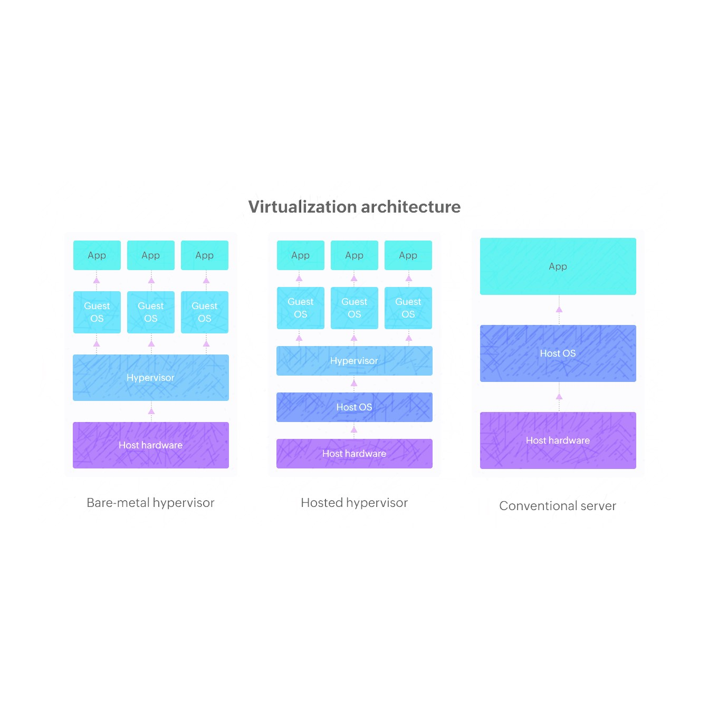
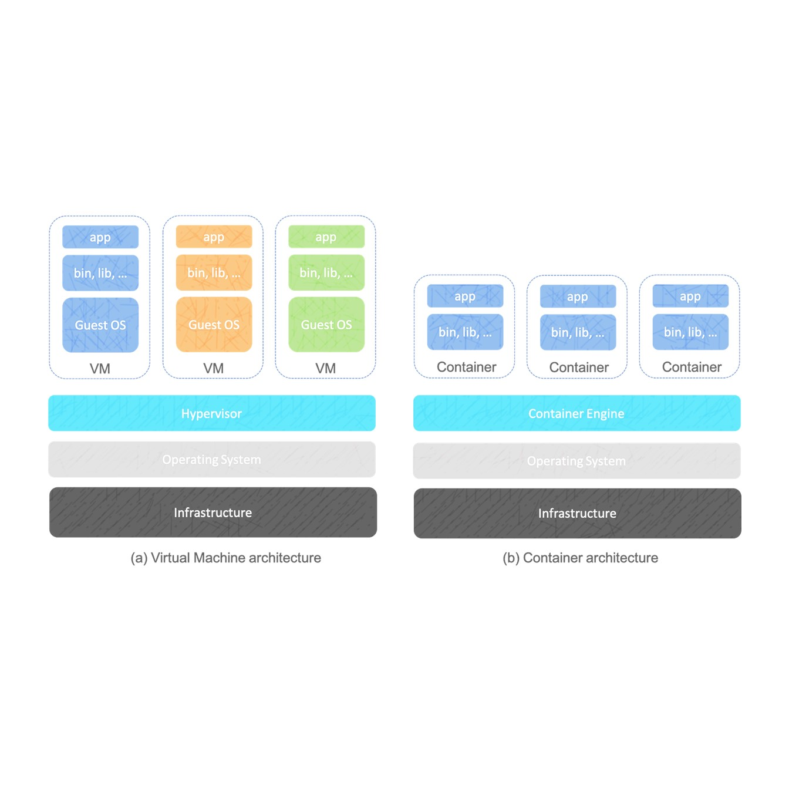
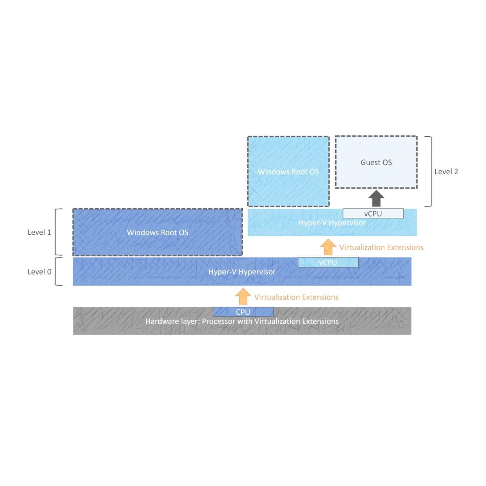
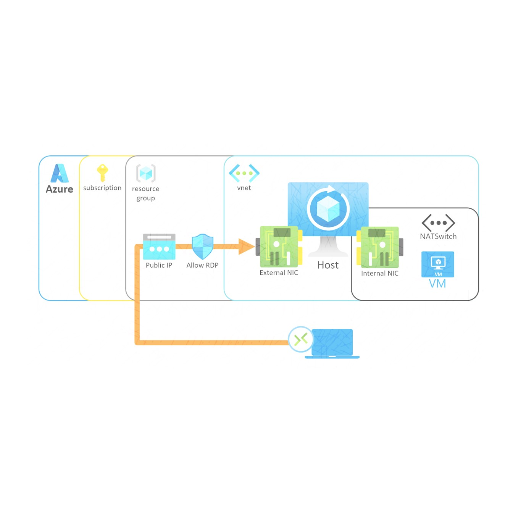

Deploy and Manage Hyper-V on Azure - Nested Virtualization

Master Microsoft Hyper V Virtualization (Azure Windows Server): Hypervisor + Cloud Management + Server Deployment

Tips/Tricks/Notes/Commands URL Link >> https://github.com/nimaxnimax/Udemy_Virtualization

Instructor & Courses >> https://www.udemy.com/user/adrian-fischer-infotech/

"Mastering Microsoft Azure and Hyper-V: Deployment and Management" is a comprehensive course designed to equip IT professionals with essential skills in deploying and managing virtualized environments on Azure. Participants will explore foundational Azure concepts such as virtual machines, networking, and storage, while mastering the installation and configuration of Hyper-V on Windows Server. Through hands-on labs and practical exercises, students will learn to optimize Hyper-V VM performance, implement backup strategies, and enhance security measures within the Azure cloud. This course is ideal for IT professionals seeking to enhance their proficiency in cloud computing and virtualization, enabling them to leverage Azure and Hyper-V effectively to meet organizational IT objectives and drive efficiency in modern IT infrastructures.


**Course Description:**

In today's digital landscape, mastering cloud technologies is paramount for IT professionals seeking to maximize efficiency, scalability, and security. This comprehensive course, "Mastering Microsoft Azure and Hyper-V: Deployment and Management," delves into the critical integration of Azure and Hyper-V, focusing on deployment strategies, management techniques, and the inherent advantages of these technologies in modern computing environments.

**Introduction to Microsoft Azure and Hyper-V**

Microsoft Azure has established itself as a leading cloud computing platform, offering a vast array of services to businesses ranging from startups to enterprises. With its global network of data centers, Azure provides scalability, reliability, and flexibility for deploying applications and managing data across the globe. Hyper-V, Microsoft's hypervisor technology, complements Azure by enabling efficient virtualization on Windows Server environments. It allows businesses to consolidate hardware resources, optimize server utilization, and streamline IT operations through virtual machines (VMs).

**Why Use Microsoft Azure and Hyper-V?**

The combination of Microsoft Azure and Hyper-V offers several compelling advantages for organizations:

1. **Scalability**: Azure allows businesses to scale resources up or down based on demand, ensuring optimal performance and cost-efficiency. Hyper-V extends this scalability by enabling the creation of VMs that can be dynamically adjusted to meet workload requirements.

2. **Cost-efficiency**: By leveraging Azure and Hyper-V, organizations can reduce infrastructure costs associated with hardware maintenance and upgrades. Virtualization with Hyper-V minimizes physical server requirements, leading to lower energy consumption and operational expenses.

3. **Security**: Azure's robust security features, including built-in compliance controls and encryption capabilities, enhance data protection. Hyper-V enhances security by isolating VMs from each other and from the host system, reducing the risk of unauthorized access or data breaches.

4. **Flexibility**: Azure supports hybrid cloud deployments, allowing organizations to seamlessly integrate on-premises infrastructure with cloud resources. Hyper-V supports nested virtualization, enabling the creation of VMs within VMs, which is beneficial for development, testing, and training scenarios.

**Course Focus: Deployment and Management**

This course focuses on equipping participants with the knowledge and skills necessary to effectively deploy and manage Hyper-V on Azure environments. Key topics include:

- **Hyper-V Basics**: Understanding the fundamentals of Hyper-V, including installation, configuration, and virtual machine management.

- **Azure Infrastructure**: Exploring Azure's infrastructure components, such as virtual networks, storage accounts, and resource groups, essential for deploying Hyper-V VMs in the cloud.

- **Deployment Strategies**: Learning best practices for deploying Hyper-V on Azure, including considerations for network connectivity, storage provisioning, and VM sizing.

- **Management Techniques**: Implementing management tasks such as monitoring VM performance, configuring backups, and optimizing resource utilization in Azure.

- **Security and Compliance**: Addressing security challenges and implementing compliance measures specific to Azure and Hyper-V environments.

**Practical Applications and Real-world Scenarios**

Throughout the course, participants engage in hands-on labs and practical exercises designed to simulate real-world scenarios. These activities provide valuable experience in deploying Hyper-V VMs on Azure, troubleshooting common issues, and optimizing performance for various workloads. By the end of the course, participants will have gained proficiency in leveraging Azure and Hyper-V to meet organizational objectives effectively.

**Who Should Attend?**

This course is ideal for IT professionals, system administrators, and cloud architects looking to deepen their understanding of Azure and Hyper-V integration. Whether you are new to cloud computing or seeking to enhance your skills in virtualization and cloud management, this course offers comprehensive insights and practical knowledge to advance your career in IT infrastructure management.

**Conclusion**

"Mastering Microsoft Azure and Hyper-V: Deployment and Management" is designed to empower participants with the expertise needed to harness the full potential of Azure and Hyper-V in today's digital era. By mastering deployment strategies, management techniques, and security best practices, participants will be well-equipped to drive efficiency, scalability, and security within their organizations' cloud environments. Join us on this journey to elevate your skills and unlock new possibilities in cloud computing and virtualization.


This course offers a comprehensive exploration of deploying and managing Microsoft Azure and Hyper-V environments, focusing on foundational skills and practical experience essential for IT professionals:

**1. Azure Fundamentals and Navigation:**
Participants will delve into the core services of Azure, including virtual machines, storage accounts, and virtual networks. Through hands-on exercises, they will learn to navigate the Azure portal efficiently and utilize tools like Azure PowerShell and Azure CLI for resource management. Understanding Azure regions, availability zones, and data residency considerations will be crucial for deploying Hyper-V VMs effectively within the Azure infrastructure.

**2. Hyper-V Deployment on Azure:**
Students will gain proficiency in installing and configuring Hyper-V on Windows Server, seamlessly integrating it with Azure. They will learn best practices for deploying Hyper-V VMs in Azure, including networking setup, storage allocation, and optimization of VM performance. Emphasis will be placed on ensuring reliability and scalability of Hyper-V VMs to meet varying workload demands in the cloud.

**3. Management of Hyper-V and Azure Resources:**
The course covers essential management tasks such as monitoring Hyper-V VMs using Azure Monitor and Log Analytics for performance insights and troubleshooting. Participants will explore backup solutions and disaster recovery strategies tailored for Hyper-V VMs hosted in Azure. Fundamental security measures, including RBAC, NSGs, and Azure Security Center, will also be implemented to protect Hyper-V deployments from potential threats.

**4. Practical Applications and Hands-On Experience:**
Through practical labs and simulations, students will apply their knowledge to real-world scenarios, gaining hands-on experience in deploying, managing, and optimizing Hyper-V environments on Azure. This practical approach will equip participants with the skills needed to leverage Azure and Hyper-V effectively for enhancing organizational efficiency, scalability, and security in cloud computing environments.

By the end of this course, participants will have acquired a solid foundation in deploying and managing Hyper-V on Azure, empowering them to utilize cloud resources efficiently and effectively meet the dynamic IT needs of modern organizations.


Participants in this course should have a foundational understanding of cloud computing concepts and familiarity with basic networking principles. Proficiency in operating systems, particularly Windows Server, is recommended, as well as experience in managing virtualized environments. Basic knowledge of Microsoft Azure services and familiarity with virtualization technologies such as Hyper-V will be advantageous. Participants should also have access to a computer with internet connectivity to engage in hands-on labs and exercises within the Azure environment.


This course is designed for IT professionals, system administrators, and cloud architects who are looking to deepen their knowledge and practical skills in deploying and managing Microsoft Azure and Hyper-V environments. It is ideal for individuals who already have some experience with cloud computing and virtualization technologies and wish to expand their capabilities specifically in the context of Azure and Hyper-V integration. Additionally, professionals seeking to enhance their understanding of Azure services such as virtual machines, networking, and storage, and how they integrate with Hyper-V, will find this course beneficial. Whether transitioning to cloud-based solutions or aiming to optimize existing virtualization setups, participants will gain valuable insights and practical expertise to effectively deploy, manage, and secure Hyper-V environments within the Azure cloud.




### Virtualization and Hypervisor Concepts

- **Virtualization**
  - Technique that allows multiple virtual instances to run on a single physical machine.
  - Enables efficient utilization of hardware resources.
  - Commonly used for creating virtual machines (VMs) to run different operating systems simultaneously.

- **Hypervisor**
  - Software layer that creates and manages virtual machines.
  - Sits between the hardware and the operating system to provide virtualization.
  - Ensures isolation and allocation of resources to each virtual machine.

- **Baremetal Hypervisor (Type 1)**
  - Installed directly on the physical hardware.
  - No underlying operating system; the hypervisor itself is the operating system.
  - Examples include VMware ESXi, Microsoft Hyper-V, and Xen.
  - Provides better performance and efficiency due to direct access to hardware resources.

- **Hosted Hypervisor (Type 2)**
  - Runs on top of an existing operating system.
  - Less efficient compared to baremetal hypervisors due to an additional layer.
  - Examples include VMware Workstation, Oracle VM VirtualBox, and Parallels Desktop.
  - Easier to set up and use, suitable for desktops and development environments.

- **Conventional Server**
  - A physical server dedicated to running a single operating system.
  - Does not use virtualization.
  - All resources (CPU, memory, storage) are allocated to the single OS and its applications.
  - Offers simplicity but lacks the flexibility and resource optimization provided by virtualization.




### Virtual Machine Architecture vs. Container Architecture

- **Virtual Machine Architecture**
  - **Components**: Each VM includes a full operating system, along with a hypervisor to manage VMs.
  - **Isolation**: Provides strong isolation as each VM runs its own OS.
  - **Resource Usage**: More resource-intensive because each VM requires a full OS.
  - **Boot Time**: Generally slower boot time as it involves booting a complete OS.

- **Container Architecture**
  - **Components**: Containers share the host OS kernel and isolate applications using user-space.
  - **Isolation**: Provides process-level isolation, which is less isolated than VMs but more efficient.
  - **Resource Usage**: Lightweight since containers share the host OS kernel and do not require a full OS per container.
  - **Boot Time**: Fast boot time as they only need to start the application processes.

### Advantages of Virtualization

- **Resource Optimization**: Efficient use of hardware by running multiple VMs on a single physical server.
- **Isolation**: Strong isolation between VMs, enhancing security and stability.
- **Flexibility**: Ability to run different operating systems and applications on the same hardware.
- **Scalability**: Easy to scale up by adding more VMs as needed.
- **Disaster Recovery**: Simplified backup and recovery solutions, as VMs can be easily replicated and moved.

### Advantages of Containers

- **Efficiency**: Lower overhead compared to VMs due to shared OS kernel, leading to better performance.
- **Portability**: Containers can run consistently across different environments, making it easier to develop and deploy applications.
- **Rapid Deployment**: Quick start-up and deployment times, enhancing development and operational workflows.
- **Scalability**: High density of containers on a single host, allowing for efficient scaling.
- **DevOps Integration**: Seamless integration with CI/CD pipelines, improving development and deployment processes.




### Nested Virtualization and Hyper-V

- **Nested Virtualization**
  - **Definition**: The ability to run virtual machines inside other virtual machines.
  - **Usage**: Allows for testing and development of virtualized environments, such as testing hypervisors or running complex multi-VM scenarios.
  - **Applications**:
    - Development and testing of software that requires virtualization.
    - Training and educational purposes to simulate enterprise environments.
    - Cloud providers use it to offer virtualized services.
  - **Performance**: Can have performance overhead due to additional layers of virtualization.
  - **Requirements**: Requires hardware and software support, typically available in modern processors (Intel VT-x, AMD-V) and supported hypervisors.

- **Hyper-V**
  - **Definition**: A hypervisor-based virtualization technology from Microsoft.
  - **Types**:
    - **Hyper-V on Windows Server**: Enterprise-level virtualization solution for servers.
    - **Hyper-V on Windows 10/11**: Provides desktop-level virtualization for developers and IT professionals.
  - **Features**:
    - Supports both Type 1 (baremetal) and Type 2 (hosted) hypervisor modes.
    - Integration with Windows environment, offering seamless management via tools like Hyper-V Manager and PowerShell.
    - Features like live migration, snapshots, and resource control for efficient VM management.
    - **Nested Virtualization Support**: Allows running Hyper-V within a VM on a Hyper-V host, enabling scenarios like running a lab environment on a single physical machine.
  - **Usage**:
    - Enterprise environments for server virtualization.
    - Development and testing of applications requiring isolated environments.
    - Creating virtual lab environments for education and training.

### Advantages of Nested Virtualization

- **Testing and Development**: Ideal for testing hypervisors, virtual environments, and complex VM setups.
- **Flexibility**: Enables running nested VMs for various purposes like development, training, and demonstrations without needing multiple physical machines.
- **Cost-Efficiency**: Reduces hardware requirements by allowing the use of fewer physical servers to achieve similar outcomes.

### Advantages of Hyper-V

- **Seamless Integration**: Tight integration with Windows OS and tools, providing a familiar environment for Windows administrators.
- **Performance**: Efficient resource utilization and robust performance, particularly on Windows Server environments.
- **Scalability**: Supports large-scale deployments with features like clustering, live migration, and extensive management tools.
- **Security**: Built-in security features like shielded VMs, which protect against unauthorized access.
- **Nested Virtualization**: Supports nested virtualization, allowing more flexible and powerful testing and development setups.

In summary, nested virtualization enhances the capability to run and test virtual environments within virtual machines, while Hyper-V offers a robust and integrated virtualization solution, particularly well-suited for Windows environments.




### Installing Hyper-V on Azure Windows Server

**Purpose**:
- **Development and Testing**: Enables developers to test Hyper-V environments and configurations within Azure, leveraging the cloud's scalability and flexibility.
- **Nested Virtualization**: Allows running virtualized workloads within virtual machines, useful for complex multi-VM scenarios, training environments, or testing other hypervisors.
- **Hybrid Environments**: Facilitates the creation of hybrid cloud environments, combining on-premises and cloud resources.

**Use Cases**:
- **Training and Education**: Create virtual labs and training environments without needing physical hardware.
- **Software Testing**: Test software that requires a virtualized environment, including other hypervisors or nested VMs.
- **Disaster Recovery**: Use nested virtualization to test disaster recovery scenarios and backups within Azure.
- **Multi-VM Scenarios**: Run complex setups like Kubernetes clusters, which require multiple VMs, all within a single Azure VM.

### Advantages of Hyper-V on Azure

- **Scalability**: Quickly scale up or down based on demand without needing to procure physical hardware.
- **Flexibility**: Deploy various configurations and test setups rapidly.
- **Cost Efficiency**: Pay for what you use with Azure's pricing model, avoiding upfront hardware costs.
- **Global Reach**: Deploy Hyper-V environments closer to your user base using Azure’s global data centers.
- **Integrated Management**: Utilize Azure’s management tools and services to manage Hyper-V deployments effectively.

### Azure Subscription, Resource Group, and VNet for Hyper-V Deployment

- **Azure Subscription**
  - **Definition**: An Azure subscription provides access to Azure services and resources, and is associated with a billing account.
  - **Purpose**: Manages access, billing, and permissions for resources deployed in Azure.
  - **Use in Hyper-V Deployment**: Required to create and manage Azure resources such as VMs, storage, and networking for Hyper-V.

- **Resource Group**
  - **Definition**: A container in Azure that holds related resources for an Azure solution.
  - **Purpose**: Organizes resources for easier management, monitoring, and access control.
  - **Use in Hyper-V Deployment**: Group all related resources like VMs, storage accounts, and network interfaces used in the Hyper-V environment, simplifying management and lifecycle operations.

- **Virtual Network (VNet)**
  - **Definition**: An isolated network within Azure that allows Azure resources to securely communicate with each other, the internet, and on-premises networks.
  - **Purpose**: Provides networking capabilities to Azure resources, including virtual machines, and can be segmented into subnets.
  - **Use in Hyper-V Deployment**:
    - **Isolation**: Ensures that the Hyper-V environment is isolated and secure.
    - **Connectivity**: Allows communication between VMs, on-premises environments, and internet resources.
    - **Network Configuration**: Define subnets, network security groups (NSGs), and other networking configurations to control traffic and enhance security.

### Summary

Installing Hyper-V on Azure Windows Server enables powerful and flexible virtualized environments, leveraging Azure's scalability and global infrastructure. Key Azure components such as subscriptions, resource groups, and VNets are essential for organizing, managing, and securing the resources involved in a Hyper-V deployment. This setup is beneficial for various use cases, including development, testing, training, and creating hybrid cloud scenarios.


### Azure Free Trial for Hyper-V Installation and Testing on Windows Server

#### What is Azure Free Trial?

- **Azure Free Trial**:
  - **Offer**: Provides new users with a limited amount of free credits to explore and use various Azure services.
  - **Duration**: Typically lasts for 30 days.
  - **Credits**: Includes $200 in free credits.
  - **Free Services**: Access to over 40 always-free services, including popular offerings like virtual machines, databases, and storage.

#### How to Register for an Azure Free Trial Account

1. **Visit the Azure Free Trial Page**:
   - Go to the [Azure Free Trial page](https://azure.microsoft.com/en-us/free/).

2. **Sign Up**:
   - Click on the "Start free" or "Start now" button.

3. **Microsoft Account**:
   - If you have a Microsoft account (e.g., Outlook, Hotmail), sign in. If not, create a new Microsoft account.

4. **Identity Verification**:
   - Provide personal information for identity verification.
   - Verify your phone number through a code sent via SMS.

5. **Payment Information**:
   - Enter valid credit card information. This is used for identity verification and to ensure seamless transition if you decide to upgrade, but you won’t be charged unless you exceed the free tier limits.
   - Azure offers a spending limit which you can enable to avoid charges beyond the free credits.

6. **Agreement**:
   - Accept the terms and conditions.

7. **Complete Registration**:
   - Once all information is verified and accepted, your Azure free trial account will be created.

### Setting Up Hyper-V on Windows Server in Azure

1. **Create a Virtual Machine**:
   - **Navigate to the Azure Portal**: [Azure Portal](https://portal.azure.com/)
   - **Create a VM**: Select "Create a resource" and then "Virtual machine".
   - **Configure VM**:
     - **Resource Group**: Create a new resource group or select an existing one.
     - **VM Name**: Provide a name for your VM.
     - **Region**: Choose a region close to you.
     - **Image**: Select a Windows Server image (e.g., Windows Server 2019 Datacenter).
     - **Size**: Choose an appropriate size for your VM. Smaller sizes are more cost-effective but ensure it meets the requirements for Hyper-V nested virtualization.
   - **Administrator Account**: Set up a username and password for the VM.

2. **Networking Configuration**:
   - **VNet**: Use an existing VNet or create a new one for the VM.
   - **Public IP**: Optionally, assign a public IP if you need to access the VM over the internet.
   - **NSG (Network Security Group)**: Configure to allow RDP (port 3389) for remote access.

3. **Deploy VM**:
   - **Review and Create**: Review your configuration and create the VM.

4. **Install Hyper-V**:
   - **Connect to VM**: Use Remote Desktop to connect to your Azure VM.
   - **Add Hyper-V Role**:
     - Open Server Manager on the VM.
     - Navigate to "Manage" -> "Add Roles and Features".
     - Proceed through the wizard, selecting "Hyper-V" when prompted.
     - Complete the installation and reboot the VM as necessary.

5. **Enable Nested Virtualization**:
   - **Run PowerShell**: Open PowerShell on your Azure VM.
   - **Enable Nested Virtualization**:
     ```powershell
     Set-VMProcessor -VMName <VMName> -ExposeVirtualizationExtensions $true
     ```

6. **Test and Use Hyper-V**:
   - **Create and Manage VMs**: Use Hyper-V Manager on the Azure VM to create and manage nested virtual machines for your testing needs.

### Summary

The Azure Free Trial offers an excellent opportunity to explore Azure services and test Hyper-V on a Windows Server VM. By following the steps to register for an account and setting up a VM, you can leverage Azure's cloud infrastructure for various testing and development scenarios involving Hyper-V.


### Creating a Resource Group in Azure and Understanding Related Concepts

#### What is a Resource Group?

- **Resource Group**:
  - A logical container that holds related Azure resources such as virtual machines, storage accounts, and virtual networks.
  - Organizes resources for easy management, deployment, and monitoring.
  - Each resource in Azure must belong to one, and only one, resource group.

#### What is a Subscription in Azure?

- **Subscription**:
  - An agreement with Microsoft to use Azure services.
  - Provides access to resources and defines billing details.
  - Determines quotas and limits on Azure services.
  - All resources in Azure are associated with a subscription.

#### What is a Region in Azure?

- **Region**:
  - A geographic area containing one or more Azure data centers.
  - Examples: East US, West Europe, Southeast Asia.
  - **Considerations**:
    - **Latency**: Choose a region close to your users to minimize latency.
    - **Compliance**: Some regions offer compliance certifications required for certain industries.
    - **Service Availability**: Not all Azure services are available in every region.
    - **Cost**: Pricing can vary by region.

#### What are Tags in Resource Groups?

- **Tags**:
  - Key-value pairs assigned to Azure resources and resource groups.
  - Used for organization, management, and cost tracking.
  - Examples:
    - Key: Environment, Value: Production
    - Key: Department, Value: Finance
    - Key: Project, Value: XYZ

### Steps to Create a Resource Group in Azure

1. **Sign In to Azure Portal**:
   - Go to [Azure Portal](https://portal.azure.com/) and sign in with your Azure account.

2. **Create a Resource Group**:
   - **Navigate to Resource Groups**:
     - In the left-hand menu, select "Resource groups" or use the search bar.
   - **Add a Resource Group**:
     - Click on "Create" or "Add".

3. **Configure the Resource Group**:
   - **Subscription**: Select the Azure subscription under which the resource group will be created.
   - **Resource Group Name**: Provide a name for the resource group (must be unique within the subscription).
   - **Region**: Choose a region where the resource group’s metadata will be stored (e.g., East US, West Europe).

4. **Add Tags (Optional)**:
   - Add key-value pairs to categorize and organize the resource group.
   - Example tags:
     - Key: Environment, Value: Development
     - Key: Owner, Value: JohnDoe
     - Key: CostCenter, Value: 12345

5. **Review and Create**:
   - Review your settings.
   - Click on "Review + create" and then "Create" to create the resource group.

### Summary

- **Resource Group**: A logical container for related Azure resources, simplifying management.
- **Subscription**: The overarching agreement that provides access to Azure services and resources, tied to billing.
- **Region**: The geographical location where resources are deployed; choose based on latency, compliance, service availability, and cost.
- **Tags**: Key-value pairs for organizing, managing, and tracking costs of resources.

By carefully choosing and setting up these elements, you can efficiently manage and optimize your Azure environment.


### Creating Virtual Networks in Azure and Related Concepts

#### What is a Virtual Network (VNet)?

- **Virtual Network (VNet)**:
  - A logically isolated network within Azure, allowing Azure resources to securely communicate with each other, the internet, and on-premises networks.
  - Similar to a traditional on-premises network but with Azure’s cloud infrastructure.

### Why Create a Virtual Network After the Resource Group?

- **Logical Organization**:
  - Resource groups help organize related resources.
  - Creating a VNet after the resource group ensures all network-related resources are organized and managed together.
  
- **Dependency Management**:
  - Ensures VNets and dependent resources like VMs are within the same group, simplifying management and deployments.

### Steps to Create a Virtual Network

1. **Sign In to Azure Portal**:
   - Go to [Azure Portal](https://portal.azure.com/) and sign in with your Azure account.

2. **Create a Virtual Network**:
   - **Navigate to Virtual Networks**:
     - Use the left-hand menu or the search bar to find "Virtual networks".
   - **Add a Virtual Network**:
     - Click on "Create" or "Add".

3. **Configure the Virtual Network**:
   - **Subscription**: Select the Azure subscription to associate with the VNet.
   - **Resource Group**: Choose the existing resource group you created or create a new one.
   - **Name**: Provide a name for the virtual network (must be unique within the subscription).
   - **Region**: Select the region where the VNet will be created (same region as other related resources is advisable).

4. **Address Space**:
   - **IP Address Range**: Define the IP address range in CIDR notation (e.g., 10.0.0.0/16).
   - **Subnet Mask**: The subnet mask is derived from the CIDR notation, determining the size of the network.

5. **Configure Subnets**:
   - **Subnet Name**: Provide a name for the subnet.
   - **Subnet Address Range**: Define the address range for the subnet (e.g., 10.0.1.0/24).

6. **Advanced Network Configurations**:
   - **Virtual Network Encryption**: Encrypts traffic within the VNet to enhance security.
   - **Azure Bastion**: Provides secure RDP and SSH connectivity to VMs without exposing them to the public internet.
   - **Azure Firewall**: Managed network security service that protects resources by filtering network traffic.
   - **Azure DDoS Protection**: Protects against distributed denial-of-service attacks.

7. **Review and Create**:
   - Review the configuration.
   - Click "Review + create" and then "Create" to create the VNet.

### Key Concepts and Considerations

- **Subscription**:
  - The overarching agreement that includes billing and access to Azure services.
  - Ensures resources are billed and managed under a specific account.

- **Resource Group**:
  - A container that holds related resources, providing a way to manage and organize resources collectively.
  
- **Virtual Network Name**:
  - Must be unique within the subscription.
  - Should be descriptive to identify its purpose or the environment it serves.

- **Region**:
  - Choose a region close to users or resources to reduce latency.
  - Consider regulatory and compliance requirements.
  - Some services may only be available in certain regions.

- **Virtual Network Encryption**:
  - Enhances security by encrypting traffic within the VNet.

- **Azure Bastion**:
  - Provides secure, seamless RDP/SSH connectivity to VMs without exposing them to the internet.

- **Azure Firewall**:
  - Protects network resources by controlling inbound and outbound traffic using rules and policies.

- **Azure DDoS Protection**:
  - Provides automatic protection against DDoS attacks, safeguarding application availability.

### IP Address and Subnet Mask in a Virtual Network

- **IP Address Range (CIDR Notation)**:
  - Defines the range of IP addresses available within the VNet.
  - Example: 10.0.0.0/16 means the network includes IP addresses from 10.0.0.0 to 10.0.255.255.

- **Subnet Mask**:
  - Derived from the CIDR notation, it determines the network's and hosts' portion of an IP address.
  - Example: A subnet mask of 255.255.255.0 for a 10.0.1.0/24 subnet means there are 256 IP addresses available, with 254 usable for hosts (10.0.1.1 to 10.0.1.254).

### Considerations for IP Addressing

- **Address Space**:
  - Ensure the address space does not overlap with other VNets or on-premises networks to avoid routing conflicts.
  - Plan for future growth and subnetting requirements.

- **Subnetting**:
  - Plan subnets based on application architecture, security requirements, and traffic patterns.
  - Use smaller subnets for security isolation and larger subnets for shared resources.

### Summary

Creating a virtual network in Azure involves selecting appropriate subscription, resource group, name, and region, along with configuring address space and advanced network options. By understanding these concepts and carefully planning, you can ensure an organized, secure, and scalable network infrastructure in Azure.


### Azure CLI: Overview, Benefits, and Installation Guide

#### What is Azure CLI?

- **Azure CLI (Command-Line Interface)**:
  - A cross-platform command-line tool for managing Azure resources.
  - Allows for the automation of Azure tasks using scripts.
  - Supports multiple operating systems including Windows, macOS, and Linux.

#### Why Use Azure CLI?

- **Efficiency**: Execute commands quickly and automate repetitive tasks.
- **Scripting**: Create scripts for deployment, configuration, and management of Azure resources.
- **Integration**: Integrate with CI/CD pipelines and other automation tools.
- **Flexibility**: Access all Azure services and manage them directly from the command line.

### Installation Guide for Azure CLI

#### Windows

1. **Download the Installer**:
   - Visit the Azure CLI [installation page for Windows](https://docs.microsoft.com/en-us/cli/azure/install-azure-cli-windows?view=azure-cli-latest).
   - Download the installer by clicking on the link for the latest MSI installer.

2. **Run the Installer**:
   - Locate the downloaded `.msi` file and double-click it.
   - Follow the prompts to complete the installation.

3. **Verify Installation**:
   - Open Command Prompt or PowerShell.
   - Run the command:
     ```sh
     az --version
     ```
   - Verify that Azure CLI is installed and the version number is displayed.

#### Ubuntu

1. **Update Repository Information**:
   - Open Terminal.
   - Update your package index:
     ```sh
     sudo apt-get update
     ```

2. **Install Dependencies**:
   - Install prerequisites:
     ```sh
     sudo apt-get install ca-certificates curl apt-transport-https lsb-release gnupg
     ```

3. **Add Microsoft Repository**:
   - Add the Microsoft signing key:
     ```sh
     curl -sL https://packages.microsoft.com/keys/microsoft.asc | sudo apt-key add -
     ```
   - Add the Azure CLI software repository:
     ```sh
     AZ_REPO=$(lsb_release -cs)
     echo "deb [arch=amd64] https://packages.microsoft.com/repos/azure-cli/ $AZ_REPO main" | sudo tee /etc/apt/sources.list.d/azure-cli.list
     ```

4. **Install Azure CLI**:
   - Update the repository information and install Azure CLI:
     ```sh
     sudo apt-get update
     sudo apt-get install azure-cli
     ```

5. **Verify Installation**:
   - Run the command:
     ```sh
     az --version
     ```
   - Verify that Azure CLI is installed and the version number is displayed.

#### macOS

1. **Install via Homebrew**:
   - Open Terminal.
   - Update Homebrew package lists:
     ```sh
     brew update
     ```
   - Install Azure CLI:
     ```sh
     brew install azure-cli
     ```

2. **Verify Installation**:
   - Run the command:
     ```sh
     az --version
     ```
   - Verify that Azure CLI is installed and the version number is displayed.

### Summary

- **Azure CLI** is a powerful tool for managing Azure resources through the command line, offering efficiency, scripting capabilities, and flexibility.
- **Installation Steps**:
  - **Windows**: Download and run the MSI installer.
  - **Ubuntu**: Use `apt-get` after adding the Microsoft repository.
  - **macOS**: Use Homebrew to install Azure CLI.

By following the steps outlined, you can easily set up Azure CLI on your preferred operating system and begin managing your Azure resources more effectively.


To install Homebrew on macOS, follow these steps:

1. **Open Terminal**:
   - You can find Terminal in the Applications > Utilities folder, or you can use Spotlight by pressing `Cmd + Space` and typing "Terminal".

2. **Run the Installation Command**:
   - Copy and paste the following command into the Terminal and press `Enter`:

     ```sh
     /bin/bash -c "$(curl -fsSL https://raw.githubusercontent.com/Homebrew/install/HEAD/install.sh)"
     ```

3. **Follow the On-Screen Instructions**:
   - The script will prompt you to enter your password (this is your macOS user password).
   - You may also need to press `Enter` to continue or type `y` (for yes) when prompted.

4. **Add Homebrew to your PATH**:
   - Once the installation is complete, you may need to add Homebrew to your PATH. The installation script will usually provide you with the necessary command to do this. It will look something like this:

     ```sh
     echo 'eval "$(/opt/homebrew/bin/brew shellenv)"' >> /Users/yourusername/.zprofile
     eval "$(/opt/homebrew/bin/brew shellenv)"
     ```

   - Copy and paste these commands into your Terminal and press `Enter`.

5. **Verify Installation**:
   - To make sure Homebrew is installed correctly, you can run:

     ```sh
     brew --version
     ```

   - This command should return the version of Homebrew that is installed.

Now, Homebrew should be installed and ready to use on your macOS system. You can start installing packages using the `brew install <package>` command.


### Using Azure CLI on Windows for Managing Azure Resources

#### Logging in with Azure CLI

1. **Open Command Prompt or PowerShell**.
2. **Login**:
   ```sh
   az login
   ```
   - This command will open a web browser and prompt you to log in with your Azure credentials.
   - After successful login, the CLI will display your account details in the terminal.

#### Checking Subscription List and Current Subscription

1. **List Subscriptions**:
   ```sh
   az account list --output table
   ```
   - This command lists all the subscriptions associated with your Azure account in a table format.

2. **Set Current Subscription**:
   ```sh
   az account set --subscription "SUBSCRIPTION_NAME_OR_ID"
   ```
   - Replace `"SUBSCRIPTION_NAME_OR_ID"` with the name or ID of the subscription you want to set as the current subscription.

3. **Check Current Subscription**:
   ```sh
   az account show --output table
   ```
   - This command displays details of the current subscription in use.

#### Checking Resource Groups and Virtual Networks

1. **List Resource Groups**:
   ```sh
   az group list --output table
   ```
   - This command lists all resource groups in your current subscription.

2. **List Virtual Networks**:
   ```sh
   az network vnet list --output table
   ```
   - This command lists all virtual networks in your current subscription.

#### Creating a Resource Group with Azure CLI

1. **Create a Resource Group**:
   ```sh
   az group create --name MyResourceGroup --location eastus
   ```
   - Replace `MyResourceGroup` with your desired resource group name.
   - Replace `eastus` with your desired region.

#### Creating a Virtual Network with Azure CLI

1. **Create a Virtual Network**:
   ```sh
   az network vnet create --resource-group MyResourceGroup --name MyVNet --address-prefix 10.0.0.0/16 --subnet-name MySubnet --subnet-prefix 10.0.1.0/24
   ```
   - Replace `MyResourceGroup` with the name of your resource group.
   - Replace `MyVNet` with your desired virtual network name.
   - Replace `10.0.0.0/16` with your desired address space for the VNet.
   - Replace `MySubnet` with your desired subnet name.
   - Replace `10.0.1.0/24` with your desired subnet address range.

#### Checking the Created Resource Group and Virtual Network

1. **Check the Resource Group**:
   ```sh
   az group show --name MyResourceGroup --output table
   ```
   - This command displays details of the specified resource group.

2. **Check the Virtual Network**:
   ```sh
   az network vnet show --resource-group MyResourceGroup --name MyVNet --output table
   ```
   - This command displays details of the specified virtual network.

### Summary

Using the Azure CLI on Windows, you can effectively manage your Azure resources with the following steps:
- **Login**: `az login`
- **Check Subscriptions**:
  - List: `az account list --output table`
  - Set: `az account set --subscription "SUBSCRIPTION_NAME_OR_ID"`
  - Show: `az account show --output table`
- **Manage Resource Groups**:
  - List: `az group list --output table`
  - Create: `az group create --name MyResourceGroup --location eastus`
  - Show: `az group show --name MyResourceGroup --output table`
- **Manage Virtual Networks**:
  - List: `az network vnet list --output table`
  - Create: `az network vnet create --resource-group MyResourceGroup --name MyVNet --address-prefix 10.0.0.0/16 --subnet-name MySubnet --subnet-prefix 10.0.1.0/24`
  - Show: `az network vnet show --resource-group MyResourceGroup --name MyVNet --output table`

These commands help you perform essential tasks such as logging in, managing subscriptions, and creating and managing Azure resources.


### Using Azure CLI on Ubuntu for Managing Azure Resources

#### Installing Azure CLI on Ubuntu

1. **Update Package Index**:
   Open Terminal and run:
   ```bash
   sudo apt-get update
   ```

2. **Install Dependencies**:
   Install required packages:
   ```bash
   sudo apt-get install ca-certificates curl apt-transport-https lsb-release gnupg
   ```

3. **Add Microsoft Signing Key and Repository**:
   Run the following commands to add the Microsoft signing key and repository:
   ```bash
   curl -sL https://packages.microsoft.com/keys/microsoft.asc | 
       gpg --dearmor | 
       sudo tee /etc/apt/trusted.gpg.d/microsoft.gpg > /dev/null

   AZ_REPO=$(lsb_release -cs)
   echo "deb [arch=amd64] https://packages.microsoft.com/repos/azure-cli/ $AZ_REPO main" | 
       sudo tee /etc/apt/sources.list.d/azure-cli.list
   ```

4. **Install Azure CLI**:
   Update the package index again and install Azure CLI:
   ```bash
   sudo apt-get update
   sudo apt-get install azure-cli
   ```

5. **Verify Installation**:
   After installation, verify Azure CLI by running:
   ```bash
   az --version
   ```

#### Logging in with Azure CLI

1. **Login**:
   ```bash
   az login
   ```
   - Follow the instructions in the terminal to open a web browser and authenticate with your Azure credentials.

#### Checking Subscription List and Current Subscription

1. **List Subscriptions**:
   ```bash
   az account list --output table
   ```

2. **Set Current Subscription**:
   ```bash
   az account set --subscription "SUBSCRIPTION_NAME_OR_ID"
   ```

3. **Check Current Subscription**:
   ```bash
   az account show --output table
   ```

#### Checking Resource Groups and Virtual Networks

1. **List Resource Groups**:
   ```bash
   az group list --output table
   ```

2. **List Virtual Networks**:
   ```bash
   az network vnet list --output table
   ```

#### Creating a Resource Group with Azure CLI

1. **Create a Resource Group**:
   ```bash
   az group create --name MyResourceGroup --location eastus
   ```

#### Creating a Virtual Network with Azure CLI

1. **Create a Virtual Network**:
   ```bash
   az network vnet create --resource-group MyResourceGroup --name MyVNet --address-prefix 10.0.0.0/16 --subnet-name MySubnet --subnet-prefix 10.0.1.0/24
   ```

#### Checking the Created Resource Group and Virtual Network

1. **Check the Resource Group**:
   ```bash
   az group show --name MyResourceGroup --output table
   ```

2. **Check the Virtual Network**:
   ```bash
   az network vnet show --resource-group MyResourceGroup --name MyVNet --output table
   ```

### Summary

Using Azure CLI on Ubuntu involves installing the CLI, logging in, managing subscriptions, and creating/managing Azure resources such as resource groups and virtual networks. The steps outlined above provide a comprehensive guide to get started with Azure CLI on Ubuntu for Azure resource management.


### Using Azure CLI on macOS for Managing Azure Resources

#### Installing Azure CLI on macOS

1. **Install Homebrew**:
   If you haven't installed Homebrew yet, open Terminal and run:
   ```bash
   /bin/bash -c "$(curl -fsSL https://raw.githubusercontent.com/Homebrew/install/HEAD/install.sh)"
   ```

2. **Install Azure CLI**:
   Once Homebrew is installed, you can install Azure CLI by running:
   ```bash
   brew update && brew install azure-cli
   ```

3. **Verify Installation**:
   After installation, verify Azure CLI by running:
   ```bash
   az --version
   ```

#### Logging in with Azure CLI

1. **Login**:
   ```bash
   az login
   ```
   - Follow the instructions in the terminal to open a web browser and authenticate with your Azure credentials.

#### Checking Subscription List and Current Subscription

1. **List Subscriptions**:
   ```bash
   az account list --output table
   ```

2. **Set Current Subscription**:
   ```bash
   az account set --subscription "SUBSCRIPTION_NAME_OR_ID"
   ```

3. **Check Current Subscription**:
   ```bash
   az account show --output table
   ```

#### Checking Resource Groups and Virtual Networks

1. **List Resource Groups**:
   ```bash
   az group list --output table
   ```

2. **List Virtual Networks**:
   ```bash
   az network vnet list --output table
   ```

#### Creating a Resource Group with Azure CLI

1. **Create a Resource Group**:
   ```bash
   az group create --name MyResourceGroup --location eastus
   ```

#### Creating a Virtual Network with Azure CLI

1. **Create a Virtual Network**:
   ```bash
   az network vnet create --resource-group MyResourceGroup --name MyVNet --address-prefix 10.0.0.0/16 --subnet-name MySubnet --subnet-prefix 10.0.1.0/24
   ```

#### Checking the Created Resource Group and Virtual Network

1. **Check the Resource Group**:
   ```bash
   az group show --name MyResourceGroup --output table
   ```

2. **Check the Virtual Network**:
   ```bash
   az network vnet show --resource-group MyResourceGroup --name MyVNet --output table
   ```

### Summary

Using Azure CLI on macOS involves installing the CLI via Homebrew, logging in, managing subscriptions, and creating/managing Azure resources such as resource groups and virtual networks. The steps provided above offer a straightforward guide to get started with Azure CLI on macOS for Azure resource management.


Creating an Azure Virtual Machine (VM) for a Hyper-V lab involves several configuration options in the Azure portal. Here's a detailed breakdown of each component and configuration option you mentioned:

### Azure Virtual Machine Basics

#### Subscription and Resource Group

- **Subscription**: The Azure subscription under which the VM will be billed and managed.
- **Resource Group**: A logical container for grouping Azure resources like VMs, networks, and storage accounts.

#### Virtual Machine Name and Regions

- **Virtual Machine Name**: A unique name for identifying your VM within Azure.
- **Region**: The geographic location where the VM's resources will be physically located.

#### Availability Options

- **Availability Options**: Configurations for high availability and resilience.
- **Availability Zone**: Physically separate locations within an Azure region to protect against data center failures.

#### Security Type and Image Options

- **Security Type**: Determines how authentication is handled (e.g., password or SSH key).
- **Image Options**: Choose from a variety of base images including different versions of Windows Server for Hyper-V.

#### Virtual Machine Architecture

- **VM Architecture**: Specifies the configuration of the virtual hardware, such as CPU, memory, and disk configuration.
- **VM Size**: Defines the size of the VM, which determines the amount of CPU cores, memory, and storage capacity.

#### Disk and Encryption Options

- **Disk Encryption**: Enables encryption of the VM's disks to enhance security.
- **Disk Size**: Specifies the size of the VM's disks, including the OS disk and any data disks attached.

#### Virtual Network, Public IP, and Network Security

- **Virtual Network (VNet)**: Defines the network configuration for the VM, including IP address ranges and subnets.
- **Public IP**: Optionally assigns a public IP address to the VM for accessing it over the internet.
- **Network Security Group (NSG)**: Contains security rules that allow or deny inbound/outbound network traffic to the VM.

#### Accelerated Networking and Load Balancing

- **Accelerated Networking**: Improves network performance by offloading certain network processing to dedicated hardware.
- **Load Balancing**: Distributes incoming network traffic across multiple VM instances to ensure high availability and scalability.

#### VM Identity, Authentication, and Management

- **VM Identity**: Enables managed identities for Azure resources to authenticate with Azure AD.
- **Authentication Type**: Specifies how users authenticate to the VM (e.g., password-based or SSH key-based).
- **Auto Shutdown**: Configures automatic shutdown schedules to reduce costs.

#### Backup, Monitoring, and Diagnostics

- **Backup**: Enables Azure Backup to protect VM data.
- **Guest OS Updates**: Automates the installation of operating system updates on the VM.
- **Monitoring**: Enables recommended alert rules and boot diagnostics for troubleshooting.

#### Health Monitoring and User Data

- **Health Monitoring**: Monitors the health and performance of the VM and its applications.
- **User Data**: Provides initialization scripts or configurations to be run on the VM during provisioning.

#### Remote Disk Storage and NVMe

- **Remote Disk Storage (NVMe)**: Utilizes high-performance NVMe storage for VM disks to improve disk I/O performance.

#### Host Groups and Tags

- **Host Groups**: Group VMs together based on specific criteria (e.g., proximity for better network performance).
- **Tags**: Key-value pairs used for organizing and managing resources, and for cost allocation.

### Summary

When creating an Azure Virtual Machine through the Azure portal, each of these configuration options allows you to tailor the VM to your specific needs, whether it's for a Hyper-V lab, production workload, or development environment. Understanding these options helps you deploy VMs that are secure, performant, and cost-effective within the Azure cloud infrastructure.


### Managing Azure Virtual Machines with Azure CLI

#### Checking Azure Virtual Machine List and Configuration

1. **List Virtual Machines**:
   ```bash
   az vm list --output table
   ```
   - Lists all VMs in the current subscription.

2. **Show VM Configuration**:
   ```bash
   az vm show --resource-group MyResourceGroup --name MyVM --query "{Name:name, ProvisioningState:provisioningState, OS:storageProfile.osDisk.osType, IP:networkProfile.networkInterfaces[0].ipConfigurations[0].privateIpAddress}" --output table
   ```
   - Replace `MyResourceGroup` with your VM's resource group name.
   - Replace `MyVM` with your VM's name.
   - Displays detailed information about the specified VM, including its name, provisioning state, operating system type, and private IP address.

#### Creating a Virtual Machine with Azure CLI

1. **Create Resource Group (if not already created)**:
   ```bash
   az group create --name MyResourceGroup --location eastus
   ```
   - Replace `MyResourceGroup` with your desired resource group name.
   - Replace `eastus` with your desired region.

2. **Create Virtual Machine**:
   ```bash
   az vm create \
       --resource-group MyResourceGroup \
       --name MyVM \
       --image UbuntuLTS \
       --admin-username azureuser \
       --admin-password MyPassword123! \
       --size Standard_DS1_v2 \
       --location eastus \
       --output table
   ```
   - `--image`: Specifies the OS image (e.g., `UbuntuLTS`, `Win2019Datacenter`).
   - `--admin-username` and `--admin-password`: Credentials to access the VM.
   - `--size`: Specifies the VM size (e.g., `Standard_DS1_v2`).
   - `--location`: Specifies the region where the VM will be created.

#### Summary

Using Azure CLI, you can efficiently manage Azure Virtual Machines by listing them, retrieving detailed configurations, and creating new VMs with specific configurations tailored to your needs. The commands provided offer essential capabilities to get started with VM management using Azure CLI. Adjust parameters such as VM size, image, username, password, and resource group to fit your specific requirements.


### Installing Hyper-V on a Windows Server 2022 VM on Azure

#### Steps to Install Hyper-V using Server Manager and PowerShell

**Pre-requisites:**
1. Ensure your VM is running Windows Server 2022.
2. Ensure you have administrative privileges on the VM.

#### Installing Hyper-V Using Server Manager

1. **Connect to your Azure VM**:
   - Connect to your Windows Server 2022 VM using Remote Desktop (RDP).

2. **Open Server Manager**:
   - Open the Start menu and select "Server Manager".

3. **Add Roles and Features**:
   - In Server Manager, click on "Add roles and features".

4. **Before You Begin**:
   - Click "Next" on the "Before You Begin" screen.

5. **Installation Type**:
   - Select "Role-based or feature-based installation" and click "Next".

6. **Select Destination Server**:
   - Ensure your server is selected and click "Next".

7. **Select Server Roles**:
   - Scroll down and select "Hyper-V".
   - A dialog box will appear to add features required for Hyper-V. Click "Add Features".

8. **Hyper-V Features**:
   - Click "Next" until you reach the "Create Virtual Switches" page.
   - Here you can configure a virtual switch if needed, or do this later. Click "Next".

9. **Virtual Machine Migration**:
   - Configure virtual machine migration settings if necessary. Click "Next".

10. **Default Stores**:
   - Specify default stores for virtual hard disks and virtual machine configuration files. Click "Next".

11. **Confirmation**:
   - Click "Install" to begin the installation.

12. **Reboot**:
   - After the installation completes, you may be prompted to restart the server. Click "Close" and restart the server if required.

#### Installing Hyper-V Using PowerShell

1. **Connect to your Azure VM**:
   - Connect to your Windows Server 2022 VM using Remote Desktop (RDP).

2. **Open PowerShell**:
   - Open PowerShell with administrative privileges.

3. **Install Hyper-V**:
   - Run the following command to install Hyper-V:
     ```powershell
     Install-WindowsFeature -Name Hyper-V -IncludeManagementTools -Restart
     ```

4. **Reboot**:
   - The server will automatically restart if the `-Restart` parameter is included. If not, you will need to manually restart the server.

#### Considerations

- **Nested Virtualization**:
  - Ensure that nested virtualization is enabled if you intend to run Hyper-V within an Azure VM. This is particularly important for Hyper-V to function properly on a virtual machine within Azure.
  - Check if your Azure VM size supports nested virtualization. Supported sizes include the Dv3 and Ev3 series.

- **VM Size**:
  - Choose an appropriate VM size that supports Hyper-V and nested virtualization. For example, `Standard_D4s_v3` or larger.

- **Networking**:
  - Configure virtual switches appropriately to ensure network connectivity for your virtual machines.

- **Resources**:
  - Ensure your VM has sufficient CPU, memory, and storage resources to run Hyper-V and the virtual machines you plan to host.

- **Licensing**:
  - Verify licensing requirements for running multiple instances of Windows Server or other operating systems in a virtualized environment.

### Summary

By following these steps, you can install and configure Hyper-V on your Windows Server 2022 VM in Azure using either Server Manager or PowerShell. Make sure to consider factors such as nested virtualization support, VM size, and network configuration to ensure a smooth and efficient setup.


If you encounter an issue where Hyper-V cannot be installed on an Azure VM running Windows Server 2022 because virtualization support is not enabled in the BIOS, it usually indicates that the VM size you are using does not support nested virtualization. Here's how you can resolve this:

### Steps to Enable Nested Virtualization on Azure VM

#### 1. Verify VM Size
Ensure that the VM size you are using supports nested virtualization. Some of the VM sizes that support nested virtualization include:
- Dv3-series
- Ev3-series
- F2s_v2, F4s_v2, F8s_v2, F16s_v2
- M-series
- Lsv2-series

#### 2. Resize the VM (if needed)
If your current VM size does not support nested virtualization, you need to resize it to a supported size.

1. **Resize VM using Azure Portal**:
   - Go to the Azure portal.
   - Navigate to your virtual machine.
   - Click on "Size" under the "Settings" section.
   - Select a size that supports nested virtualization (e.g., Standard_D4s_v3).
   - Click "Resize" to apply the changes.

2. **Resize VM using Azure CLI**:
   - Open Azure CLI and run the following command:
     ```bash
     az vm resize --resource-group MyResourceGroup --name MyVM --size Standard_D4s_v3
     ```
   - Replace `MyResourceGroup` with the name of your resource group.
   - Replace `MyVM` with the name of your virtual machine.
   - Replace `Standard_D4s_v3` with a size that supports nested virtualization.

#### 3. Enable Nested Virtualization
After ensuring that your VM size supports nested virtualization, you need to enable it.

1. **Enable Nested Virtualization using PowerShell**:
   - Connect to your Azure VM using Remote Desktop.
   - Open PowerShell with administrative privileges.
   - Run the following command to enable nested virtualization:
     ```powershell
     Set-VMProcessor -VMName MyVM -ExposeVirtualizationExtensions $true
     ```
   - Replace `MyVM` with the name of your virtual machine.

2. **Enable Nested Virtualization using Azure CLI**:
   - Open Azure CLI and run the following command:
     ```bash
     az vm stop --resource-group MyResourceGroup --name MyVM
     az vm update --resource-group MyResourceGroup --name MyVM --set nestedVirtualization=true
     az vm start --resource-group MyResourceGroup --name MyVM
     ```
   - Replace `MyResourceGroup` with the name of your resource group.
   - Replace `MyVM` with the name of your virtual machine.

#### 4. Install Hyper-V
After enabling nested virtualization, you can proceed with the installation of Hyper-V using either Server Manager or PowerShell as described earlier.

### Summary
To install Hyper-V on an Azure VM running Windows Server 2022, you need to ensure that nested virtualization is enabled. This involves verifying that the VM size supports nested virtualization, resizing the VM if necessary, and enabling nested virtualization through PowerShell or Azure CLI. Once these steps are completed, you can proceed with installing Hyper-V on your Azure VM.


### Troubleshooting a Faulty Azure VM using Nested Virtualization in Azure

Nested virtualization allows you to run a Hyper-V virtual machine inside an Azure virtual machine. This can be particularly useful for troubleshooting a faulty Azure VM by simulating the same environment.

### PowerShell Commands for Nested Virtualization Setup

1. **Check Current Boot Configuration**:
   Use `bcdedit /enum` to list the current boot configuration settings.
   ```powershell
   bcdedit /enum
   ```
   This command displays the current boot configuration data, including settings that control how the hypervisor is launched.

2. **Set Hypervisor Launch Type to Auto**:
   Configure the system to start the hypervisor automatically.
   ```powershell
   bcdedit /set hypervisorlaunchtype auto
   ```
   This ensures that the hypervisor is launched at boot time, which is necessary for running nested virtual machines.

3. **Restart the VM**:
   Apply the changes by restarting the VM.
   ```powershell
   Restart-Computer -Force
   ```
   This command forces a restart of the computer to apply the new boot configuration settings.

### Full Steps to Enable Nested Virtualization and Set Up Hyper-V

#### 1. Stop the VM
   Ensure the VM is deallocated before making changes.
   ```bash
   az vm deallocate --resource-group AZHVRG3 --name AZHVVM1
   ```

#### 2. Enable Nested Virtualization
   Enable nested virtualization on your Azure VM.
   ```bash
   az vm update --resource-group AZHVRG3 --name AZHVVM1 --set "additionalCapabilities.enableNestedVirtualization=true"
   ```

#### 3. Start the VM
   Start the VM again after enabling nested virtualization.
   ```bash
   az vm start --resource-group AZHVRG3 --name AZHVVM1
   ```

#### 4. Connect to the VM
   Use Remote Desktop to connect to the VM.

#### 5. Open PowerShell and Check Boot Configuration
   ```powershell
   bcdedit /enum
   ```

#### 6. Set Hypervisor Launch Type to Auto
   ```powershell
   bcdedit /set hypervisorlaunchtype auto
   ```

#### 7. Restart the VM
   ```powershell
   Restart-Computer -Force
   ```

#### 8. Install Hyper-V (if not already installed)
   ```powershell
   Install-WindowsFeature -Name Hyper-V -IncludeManagementTools -Restart
   ```

### Using Nested Virtualization for Troubleshooting

1. **Create a Nested VM**:
   Once Hyper-V is installed and configured, you can create a new virtual machine inside the Azure VM to simulate the same environment as your faulty VM.
   
2. **Migrate Faulty VM's Configuration**:
   Export the configuration of the faulty VM and import it into the nested VM to replicate the issue.
   
3. **Analyze and Fix**:
   Use the nested VM to diagnose and troubleshoot the issue without affecting the production environment.

### Summary

By setting up nested virtualization and configuring the hypervisor launch type, you can effectively troubleshoot a faulty Azure VM in a controlled environment. These steps ensure that you have a robust setup for simulating and resolving issues using Hyper-V inside an Azure VM.


Reinstalling your current Azure VM with Windows Server 2022 using the Azure portal involves creating a new VM with the same configuration or using the Azure portal to redeploy the existing VM. Here's how you can do it:

### Method 1: Redeploy the Existing VM

Redeploying the VM moves it to a new node in Azure's data center. This can resolve underlying host issues without losing your VM configuration.

1. **Navigate to the Azure Portal**:
   - Go to the [Azure portal](https://portal.azure.com) and sign in with your Azure account.

2. **Locate Your VM**:
   - Navigate to "Virtual machines" and select the VM you want to redeploy.

3. **Redeploy the VM**:
   - In the VM's settings, click on "Redeploy + reapply" under the "Support + troubleshooting" section.
   - Click "Redeploy" to move the VM to a new Azure node.

This process will not reinstall the OS but may resolve host-level issues.

### Method 2: Reinstall the VM OS by Creating a New VM

If you need to completely reinstall the OS, you'll need to create a new VM and configure it similarly to the existing one. Here's how:

1. **Backup Existing Data**:
   - Before proceeding, ensure you have backups of any important data on the existing VM.

2. **Create a New VM**:
   - In the Azure portal, go to "Virtual machines" and click on "Create" and then "Azure virtual machine."

3. **Configure the New VM**:
   - **Basics**:
     - **Subscription**: Select your subscription.
     - **Resource group**: Choose an existing resource group or create a new one.
     - **Virtual machine name**: Give your new VM a name.
     - **Region**: Select the same region as your existing VM.
     - **Availability options**: Choose the same availability options as the existing VM.
     - **Image**: Select "Windows Server 2022."
     - **Size**: Choose the same size as the existing VM.

   - **Administrator Account**:
     - **Username**: Enter the administrator username.
     - **Password**: Enter the administrator password.

   - **Disks**:
     - Configure the OS disk and any additional data disks.

   - **Networking**:
     - **Virtual network**: Select the same virtual network as the existing VM.
     - **Public IP**: Choose whether to use a new or existing public IP address.
     - **Network security group (NSG)**: Configure the same NSG settings.

   - **Management**:
     - Enable boot diagnostics, monitoring, and auto-shutdown if required.

   - **Advanced, Tags, and Review + Create**:
     - Configure advanced settings and tags if needed.
     - Review your configurations and click "Create."

4. **Install and Configure Applications**:
   - Once the new VM is created, install any necessary applications and restore data from backups.

5. **Decommission Old VM**:
   - After verifying the new VM works correctly, you can decommission the old VM.

### Steps to Redeploy the VM via Azure Portal (Step-by-Step)

1. **Sign in to the Azure Portal**:
   - Open your web browser and navigate to [Azure Portal](https://portal.azure.com).
   - Sign in with your Azure account credentials.

2. **Navigate to Virtual Machines**:
   - In the left-hand menu, click on "Virtual machines."
   - Find and select the VM you want to redeploy.

3. **Redeploy the VM**:
   - In the VM's blade, scroll down to the "Support + troubleshooting" section.
   - Click on "Redeploy + reapply."
   - On the "Redeploy + reapply" page, click the "Redeploy" button.

This action moves the VM to a new host and can help resolve issues related to the host machine without changing any of the VM's data or configurations.

### Summary

By either redeploying the existing VM or creating a new VM with the same configuration, you can effectively troubleshoot or reinstall Windows Server 2022 on your Azure VM. Ensure that you have backups of important data before proceeding with any of these operations.


### Managing Azure Virtual Machines with Azure CLI

Azure CLI provides a powerful set of commands to manage Azure resources, including virtual machines (VMs). Below are some key commands to help you manage your Azure VMs, check the current VM list, and get more information about a specific VM (e.g., AZHVVM1).

### Prerequisites

1. **Azure CLI**: Ensure you have Azure CLI installed. You can install it from [here](https://docs.microsoft.com/en-us/cli/azure/install-azure-cli).
2. **Sign In**: Log in to your Azure account using the following command:
   ```bash
   az login
   ```
   This will open a browser window for you to enter your Azure credentials.

### Checking the Current VM List

To list all VMs in a specific resource group or across your subscription:

1. **List All VMs in a Subscription**:
   ```bash
   az vm list --output table
   ```
   This command lists all VMs in your subscription in a tabular format.

2. **List VMs in a Specific Resource Group**:
   ```bash
   az vm list --resource-group <ResourceGroupName> --output table
   ```
   Replace `<ResourceGroupName>` with the name of your resource group.

### Getting More Information about a Specific VM (AZHVVM1)

To get detailed information about a specific VM:

1. **Show VM Details**:
   ```bash
   az vm show --resource-group <ResourceGroupName> --name AZHVVM1 --output json
   ```
   This command displays detailed information about the VM `AZHVVM1` in JSON format. Replace `<ResourceGroupName>` with the appropriate resource group name.

2. **Get Instance View**:
   This provides the status of the VM, including power state and extensions.
   ```bash
   az vm get-instance-view --resource-group <ResourceGroupName> --name AZHVVM1 --output json
   ```

3. **Get VM IP Addresses**:
   This command retrieves the public and private IP addresses of the VM.
   ```bash
   az vm list-ip-addresses --resource-group <ResourceGroupName> --name AZHVVM1 --output table
   ```

### Example Workflow

Let's go through an example workflow for managing VMs.

#### Step 1: List All VMs in a Subscription

```bash
az vm list --output table
```

#### Step 2: List VMs in a Specific Resource Group

```bash
az vm list --resource-group AZHVRG3 --output table
```

#### Step 3: Get Detailed Information about a Specific VM (AZHVVM1)

```bash
az vm show --resource-group AZHVRG3 --name AZHVVM1 --output json
```

#### Step 4: Get Instance View of the VM

```bash
az vm get-instance-view --resource-group AZHVRG3 --name AZHVVM1 --output json
```

#### Step 5: Get IP Addresses of the VM

```bash
az vm list-ip-addresses --resource-group AZHVRG3 --name AZHVVM1 --output table
```

### Conclusion

By using Azure CLI, you can efficiently manage Azure VMs, retrieve their status, and obtain detailed information. These commands help you automate and streamline your workflow, making it easier to manage resources within your Azure environment.


Using Azure CLI, you can start, stop, and shut down your Azure Virtual Machines (VMs) with simple commands. Below are the steps and commands to manage your VM (e.g., AZHVVM1) in these ways.

### Start a Virtual Machine

To start a VM, use the `az vm start` command:

```bash
az vm start --resource-group <ResourceGroupName> --name AZHVVM1
```

Replace `<ResourceGroupName>` with the name of your resource group where the VM resides.

### Stop (Deallocate) a Virtual Machine

To stop and deallocate a VM, use the `az vm deallocate` command. This action releases the hardware resources but retains the VM's configuration and data.

```bash
az vm deallocate --resource-group <ResourceGroupName> --name AZHVVM1
```

### Shutdown a Virtual Machine

Stopping (deallocating) and shutting down a VM are generally the same in the context of Azure CLI. However, if you want to perform a regular OS shutdown without deallocating the resources, you can use the `az vm stop` command:

```bash
az vm stop --resource-group <ResourceGroupName> --name AZHVVM1
```

This command shuts down the operating system of the VM, but unlike `deallocate`, it doesn't release the underlying compute resources. It is equivalent to turning off the machine's power.

### Example Workflow

#### Step 1: Start the Virtual Machine

```bash
az vm start --resource-group AZHVRG3 --name AZHVVM1
```

#### Step 2: Stop and Deallocate the Virtual Machine

```bash
az vm deallocate --resource-group AZHVRG3 --name AZHVVM1
```

#### Step 3: Shutdown the Virtual Machine (OS-level shutdown)

```bash
az vm stop --resource-group AZHVRG3 --name AZHVVM1
```

### Summary of Commands

- **Start a VM**:
  ```bash
  az vm start --resource-group <ResourceGroupName> --name AZHVVM1
  ```

- **Stop and Deallocate a VM**:
  ```bash
  az vm deallocate --resource-group <ResourceGroupName> --name AZHVVM1
  ```

- **Shutdown a VM (OS-level shutdown)**:
  ```bash
  az vm stop --resource-group <ResourceGroupName> --name AZHVVM1
  ```

### Notes

- **Start**: Boots up the VM and makes it available for use.
- **Stop (Deallocate)**: Shuts down the VM and releases the hardware resources, reducing costs.
- **Stop (Shutdown)**: Shuts down the VM's operating system but does not release the hardware resources, which continues to incur compute costs.

Using these commands, you can efficiently manage the state of your Azure VMs through the Azure CLI.


### Hyper-V Virtual Switch Manager

The Hyper-V Virtual Switch Manager is a feature in Microsoft Hyper-V that allows you to create and manage virtual switches. These virtual switches enable virtual machines (VMs) to communicate with each other and with external networks. 

### Types of Virtual Switches

1. **External Virtual Switch**:
   - **Description**: Connects VMs to a physical network. VMs connected to an external switch can communicate with each other and with the external network (including the internet).
   - **Use Cases**: When VMs need to access external network resources or be accessible from outside the host.
   - **Example**: A VM that needs internet access or to be accessed by other devices on the physical network.

2. **Internal Virtual Switch**:
   - **Description**: Allows communication between VMs on the same host and between VMs and the host itself, but not with the external network.
   - **Use Cases**: Useful for test environments or when VMs need to communicate only with each other and the host without needing external network access.
   - **Example**: A development environment where multiple VMs need to interact with the host machine but not the internet.

3. **Private Virtual Switch**:
   - **Description**: Allows communication only between VMs on the same host. The host cannot communicate with the VMs, and the VMs cannot communicate with external networks.
   - **Use Cases**: Highly secure environments where VMs need to be isolated from the host and external networks.
   - **Example**: Testing environments where VMs should be completely isolated for security reasons.

### Creating an External Virtual Switch with Hyper-V

#### Using Hyper-V Manager GUI

1. **Open Hyper-V Manager**:
   - Click on "Start" and search for "Hyper-V Manager". Open it.

2. **Open Virtual Switch Manager**:
   - In the left-hand pane, select the Hyper-V host.
   - In the right-hand pane, under "Actions", click on "Virtual Switch Manager".

3. **Create an External Virtual Switch**:
   - In the Virtual Switch Manager window, select "New virtual network switch" and choose "External".
   - Click on "Create Virtual Switch".

4. **Configure the Virtual Switch**:
   - **Name**: Give your virtual switch a name.
   - **Connection Type**: Ensure "External network" is selected.
   - **Adapter**: Choose the physical network adapter you want to bind to this virtual switch.
   - **Allow management operating system to share this network adapter**: Check this box if you want the host OS to use this network adapter as well.
   - Click "OK" to create the switch.

#### Using PowerShell

1. **Open PowerShell**:
   - Right-click on "Start" and select "Windows PowerShell (Admin)".

2. **Create an External Virtual Switch**:
   ```powershell
   New-VMSwitch -Name "ExternalSwitch" -NetAdapterName "Ethernet" -AllowManagementOS $true
   ```
   - **Name**: The name of the new virtual switch, e.g., "ExternalSwitch".
   - **NetAdapterName**: The name of the physical network adapter you want to use, e.g., "Ethernet".
   - **AllowManagementOS**: Specifies whether the management operating system should share the network adapter.

### Use Cases for Each Switch Type

- **External Virtual Switch**:
  - VMs needing internet access or communication with other physical network devices.
  - Hosting services that need to be accessible from other devices on the network.

- **Internal Virtual Switch**:
  - Development environments where VMs need to communicate with each other and the host but not with external networks.
  - Testing configurations that require host-VM interaction.

- **Private Virtual Switch**:
  - Highly secure environments where isolation of VMs is necessary.
  - Testing scenarios where VM interaction is needed without any external interference or access.

### Summary

- **Hyper-V Virtual Switch Manager**: Manages virtual switches in Hyper-V.
- **External Virtual Switch**: Connects VMs to the external network.
- **Internal Virtual Switch**: Connects VMs to each other and the host only.
- **Private Virtual Switch**: Connects VMs to each other only.
- **Creating an External Virtual Switch**: Can be done via Hyper-V Manager GUI or PowerShell.

Using these methods and understanding the different types of virtual switches allows for effective network management and configuration in Hyper-V environments.


To check the list of virtual switches configured in Hyper-V using PowerShell, you can use the following command:

```powershell
Get-VMSwitch
```

This command retrieves a list of all virtual switches configured on the Hyper-V host along with their details. Here’s how you can interpret and utilize the output:

### PowerShell Command Explanation:

1. **Open PowerShell**: Launch PowerShell with administrative privileges.

2. **Run the Command**:
   ```powershell
   Get-VMSwitch
   ```

### Example Output:

The output typically includes details such as:

- **Name**: Name of the virtual switch.
- **SwitchType**: Type of the virtual switch (External, Internal, or Private).
- **NetAdapterInterfaceDescription**: Description of the physical network adapter associated with the switch (for External switches).

Here's a simplified example of what the output might look like:

```
Name               SwitchType    NetAdapterInterfaceDescription
----               ----------    ------------------------------
ExternalSwitch     External      Intel(R) Ethernet Connection
InternalSwitch     Internal
PrivateSwitch      Private
```

### Interpreting the Output:

- **Name**: Identifies the name of each virtual switch.
- **SwitchType**: Specifies whether the switch is External (connected to a physical adapter), Internal (internal communication only), or Private (isolated communication).
- **NetAdapterInterfaceDescription**: Describes the physical network adapter associated with External switches.

### Additional Options:

- To view more detailed information about a specific virtual switch, including its properties and configuration, you can use:
  ```powershell
  Get-VMSwitch -Name "SwitchName"
  ```
  Replace `"SwitchName"` with the name of the virtual switch you want to inspect.

### Summary:

Using PowerShell's `Get-VMSwitch` command provides a straightforward way to list and examine the virtual switches configured in Hyper-V. This command is essential for managing and troubleshooting network configurations within your virtual environment.


An ISO image file, often referred to simply as an "ISO," is a disk image of an optical disc. It contains an exact copy of the data stored on a CD, DVD, or Blu-ray disc, including the file system and boot information. ISO files are commonly used for distributing software, operating systems, and other large sets of files that would traditionally be distributed on physical discs.

### How to Download Windows Server 2022 ISO Image

To download the Windows Server 2022 ISO image, follow these steps:

1. **Visit the Microsoft Evaluation Center**:
   - Go to the [Microsoft Evaluation Center](https://www.microsoft.com/en-us/evalcenter/evaluate-windows-server-2022) website.

2. **Select Windows Server 2022**:
   - Choose "Windows Server 2022" from the available options.

3. **Download the ISO**:
   - Click on the "Download" button to download the ISO image file.
   - You may need to sign in with a Microsoft account or register if prompted.

### How to Download Ubuntu 22 Desktop ISO Image

To download the Ubuntu 22 Desktop ISO image, follow these steps:

1. **Visit the Ubuntu Desktop Download Page**:
   - Go to the [Ubuntu Desktop Download](https://ubuntu.com/download/desktop) page on the official Ubuntu website.

2. **Select Ubuntu Desktop 22.04 LTS (or the latest version)**:
   - Choose the version of Ubuntu Desktop you want to download (e.g., Ubuntu 22.04 LTS).

3. **Download the ISO**:
   - Click on the "Download" button to download the Ubuntu Desktop ISO image file.
   - The download should start automatically.

### Installing ISO Images on Hyper-V

Once you have downloaded the ISO images for Windows Server 2022 and Ubuntu Desktop 22.04 (or your desired versions):

1. **Open Hyper-V Manager**:
   - Launch Hyper-V Manager on your Windows Server.

2. **Create a New Virtual Machine**:
   - Follow the wizard to create a new virtual machine (`New > Virtual Machine`).
   - Specify the VM name, location, generation (usually Generation 2 for modern operating systems), and assign memory and storage as needed.

3. **Configure Installation Media**:
   - When prompted to connect installation media, select "Install an operating system from a bootable CD/DVD-ROM" and choose the ISO image file you downloaded for Windows Server 2022 or Ubuntu Desktop.

4. **Complete the VM Setup**:
   - Proceed with the wizard to complete the setup of the virtual machine, configuring settings such as networking, virtual hard disk size, and so on.

5. **Install the Operating System**:
   - Start the virtual machine and follow the installation prompts from the ISO image to install Windows Server 2022 or Ubuntu Desktop.

### Summary

- **ISO Image**: Disk image of an optical disc, used for distributing software and operating systems.
- **Downloading ISO Images**:
  - Windows Server 2022: From the [Microsoft Evaluation Center](https://www.microsoft.com/en-us/evalcenter/evaluate-windows-server-2022).
  - Ubuntu 22 Desktop: From the [Ubuntu Desktop Download](https://ubuntu.com/download/desktop) page.
- **Installing ISO Images on Hyper-V**: Create a new VM in Hyper-V Manager, connect the downloaded ISO image as installation media, and proceed with the installation within the virtual machine.


Creating a virtual machine (VM) on Hyper-V involves several steps and considerations. Below is a guide that covers these aspects:

### Steps to Create a Virtual Machine on Hyper-V

1. **Open Hyper-V Manager**:
   - Launch Hyper-V Manager on your Windows Server or Windows 10/11 machine.

2. **Create a New Virtual Machine**:
   - Click on `New > Virtual Machine` in the right-hand Actions pane.

3. **Specify Virtual Machine Name and Location**:
   - **Name**: Enter a name for your virtual machine.
   - **Location**: Choose or create a directory where you want to store the virtual machine files.

4. **Choose Generation**:
   - - **Generation 1**: Supports legacy operating systems like older versions of Windows and certain Linux distributions. Uses BIOS firmware.
     - **Generation 2**: Supports newer operating systems with UEFI firmware, providing faster boot times and improved security features.

5. **Assign Memory**:
   - **Startup Memory**: Amount of RAM assigned to the VM when it starts.
   - **Dynamic Memory**: Optional setting to allow the VM to use memory resources more efficiently by adjusting memory allocation dynamically based on workload demands.

6. **Configure Networking**:
   - **Connection to Virtual Switch**: Choose an existing virtual switch or create a new one to connect your VM to the network.
   - **Network Adapter**: Select the virtual network adapter that will provide network connectivity to the VM.

7. **Create Virtual Hard Disk**:
   - **File Type**: Choose VHDX (Virtual Hard Disk - Expandable) or VHD (Legacy Virtual Hard Disk).
   - **File Size**: Specify the initial size of the virtual hard disk. VHDX supports larger sizes and has better resilience to corruption than VHD.

8. **Install Operating System**:
   - Connect the VM to the bootable ISO image of the operating system you want to install.
   - Follow the installation prompts within the VM to install the operating system.

### Considerations

- **Virtual Machine Name**: Choose a descriptive name that identifies the purpose or role of the VM.
- **Location**: Store VM files on a fast, reliable storage device to ensure performance.
- **Generation 1 vs. Generation 2**:
  - Generation 1 is compatible with older operating systems and uses BIOS.
  - Generation 2 offers faster boot times, improved security features with UEFI, and supports newer operating systems.
- **Memory**:
  - **Startup Memory**: Initial amount of RAM allocated to the VM.
  - **Dynamic Memory**: Adjusts memory allocation based on VM workload, enhancing resource efficiency.
- **Networking**:
  - Connect VMs to virtual switches for network connectivity. Choose the appropriate network adapter based on the VM's network requirements.
- **Virtual Hard Disk (VHDX)**:
  - Use VHDX for better performance, resilience, and support for larger disk sizes.
  - Specify initial disk size and consider future growth requirements.

### Example Scenario

Suppose you are creating a VM named `TestVM` on Hyper-V:

- Generation: Generation 2 (for Windows Server 2019 or newer OS)
- Memory: Startup Memory 4 GB, Dynamic Memory enabled
- Networking: Connected to "ExternalSwitch" virtual switch
- Virtual Hard Disk: VHDX format, initial size 50 GB
- Operating System: Install from a bootable ISO image of Windows Server 2022

Following these steps and considerations ensures you configure the VM correctly and optimize its performance and functionality within your Hyper-V environment.


Hyper-V provides a variety of settings to configure and optimize your virtual machines (VMs). Here’s an overview of key settings and what they do:

### Hardware Settings

1. **Add Hardware**:
   - **SCSI Controller**: Allows you to add virtual hard disks and DVD drives. SCSI controllers are hot-swappable, meaning you can add or remove devices while the VM is running.
   - **Network Adapter**: Connects your VM to a virtual switch, allowing network communication.
   - **Fibre Channel Adapter**: Used for connecting to Fibre Channel storage.

### Firmware

- **Boot Order**: Specifies the order in which devices are checked for a bootable operating system.
- **Secure Boot**: A security standard that helps ensure the VM boots using only software trusted by the hardware manufacturer.
- **TPM (Trusted Platform Module)**: Used for encrypting the VM and ensuring the integrity of the boot process.
- **Security Policy Shielding**: Provides enhanced security features to protect the VM from tampering and unauthorized access.

### Memory Settings

- **Dynamic Memory**: Automatically adjusts the amount of memory allocated to the VM based on its needs.
- **Memory Weight**: Determines the priority of the VM’s memory allocation compared to other VMs.
  
### Processor Settings

- **Number of Virtual Processors**: The number of CPU cores allocated to the VM.
- **Reserve**: The minimum percentage of the host’s CPU resources guaranteed to the VM.
- **Limit**: The maximum percentage of the host’s CPU resources the VM can use.
- **Weight**: Priority of CPU resource allocation compared to other VMs.

### Storage Settings

- **Hard Drive**:
  - **Edit**: Modify the virtual hard disk (VHD/VHDX), such as expanding the size.
  - **Inspect**: View detailed information about the virtual hard disk.
  
### Network Settings

- **Network Adapter**:
  - **VLAN ID**: Assigns a VLAN ID to the network adapter for network segmentation.
  - **Bandwidth Management**: Limits the bandwidth used by the network adapter to ensure fair resource distribution.

### Integration Services

- Services that enhance the integration between the VM and the host, such as time synchronization, heartbeat, backup, and guest services.

### Checkpoints

- **Checkpoint**: A snapshot of the VM at a particular point in time, useful for backups and testing changes.
- **Automatic Checkpoint**: Automatically creates checkpoints based on predefined conditions or schedules.

### Paging File Location

- **Paging File**: A file used by the operating system to simulate additional RAM by using disk space. You can specify the location of the paging file for better performance.

### Automatic Start Action

- Configures the action to take when the host starts up:
  - **Nothing**: VM does not start automatically.
  - **Automatically Start if it was running**: VM starts only if it was running before the host was shut down.
  - **Always Start**: VM always starts when the host starts.

### Automatic Stop Action

- Configures the action to take when the host shuts down:
  - **Save the Virtual Machine State**: Saves the current state of the VM, allowing it to resume quickly.
  - **Turn off the Virtual Machine**: Powers off the VM without saving its state.
  - **Shut Down the Guest Operating System**: Initiates a graceful shutdown of the VM’s operating system.

### Detailed Example: Configuring a VM

1. **Add a SCSI Controller**:
   - Go to VM settings, select “Add Hardware,” and choose “SCSI Controller.”
   - Use the SCSI controller to add virtual hard disks or DVD drives.

2. **Network Adapter Configuration**:
   - Select “Network Adapter,” set the VLAN ID if needed, and configure bandwidth management.

3. **Memory Settings**:
   - Enable dynamic memory and set the startup memory (e.g., 4 GB).
   - Adjust memory weight to prioritize memory allocation.

4. **Processor Settings**:
   - Assign 4 virtual processors.
   - Set reserve to 20%, limit to 80%, and weight to 100.

5. **Hard Drive**:
   - Inspect and edit the VHDX file to ensure it meets storage requirements.

6. **Integration Services**:
   - Enable services like time synchronization and guest services.

7. **Checkpoints**:
   - Enable automatic checkpoints to create snapshots regularly.

8. **Paging File Location**:
   - Specify a fast SSD for the paging file to improve performance.

9. **Automatic Start/Stop Actions**:
   - Configure the VM to start automatically if it was running before a shutdown and to save the state on host shutdown.

By understanding and configuring these settings, you can optimize your Hyper-V VMs for performance, security, and resource management, ensuring they meet your specific needs and workloads.


In addition to the primary configuration settings covered previously, there are several other important settings and considerations for managing Hyper-V environments effectively:

### Advanced Settings

1. **Enhanced Session Mode**:
   - Allows for improved interaction with VMs, providing features like copy-paste between host and VM, better display resolutions, and device redirection.
   - **Enable Enhanced Session Mode**:
     - Open Hyper-V Manager.
     - Right-click on the host and select "Hyper-V Settings."
     - Under "Enhanced Session Mode Policy," check "Allow enhanced session mode."

2. **NUMA (Non-Uniform Memory Access) Settings**:
   - Optimizes performance for VMs with multiple processors by allocating memory closer to the processors.
   - **Configure NUMA**:
     - In VM settings, go to "Processor" and expand "NUMA," then adjust the settings based on your hardware configuration.

3. **Virtual Machine Queues (VMQ)**:
   - Enhances network performance by offloading network processing from the VM to the physical network adapter.
   - **Enable VMQ**:
     - Go to the network adapter settings of the host and enable VMQ if supported.

4. **Storage Quality of Service (QoS)**:
   - Manages and monitors the storage performance of VMs to ensure fair resource distribution.
   - **Set Storage QoS**:
     - In VM settings, go to the "Hard Drive" section, and configure QoS settings.

5. **Failover Clustering**:
   - Provides high availability for VMs by grouping multiple Hyper-V hosts into a cluster.
   - **Configure Failover Clustering**:
     - Set up a cluster using Windows Server Failover Clustering and configure clustered shared volumes (CSV) for shared storage.

6. **Live Migration**:
   - Allows VMs to be moved between Hyper-V hosts with no downtime.
   - **Enable Live Migration**:
     - Open Hyper-V Manager, right-click on the host, select "Hyper-V Settings," and configure live migration settings.

### Backup and Recovery

1. **VM Backup**:
   - Ensure regular backups using Hyper-V-aware backup solutions.
   - Consider using Windows Server Backup, System Center Data Protection Manager (DPM), or third-party solutions like Veeam.

2. **Replication**:
   - Hyper-V Replica allows you to replicate VMs from one host to another for disaster recovery.
   - **Configure Hyper-V Replica**:
     - Right-click on the VM, select "Enable Replication," and follow the wizard to configure replication settings.

### Monitoring and Performance

1. **Resource Metering**:
   - Tracks resource usage (CPU, memory, network, storage) for VMs.
   - **Enable Resource Metering**:
     - Use PowerShell: `Enable-VMResourceMetering -VMName "VMName"`

2. **Performance Monitoring**:
   - Monitor performance using Hyper-V Manager, Performance Monitor, or third-party tools like SolarWinds or PRTG.

### Security

1. **Shielded VMs**:
   - Provides enhanced protection for VMs against tampering and unauthorized access.
   - **Configure Shielded VMs**:
     - Requires a Host Guardian Service (HGS) setup and configuring the VM as shielded.

2. **Virtual TPM (vTPM)**:
   - Provides hardware-based security features for encrypting the VM and ensuring secure boot.
   - **Enable vTPM**:
     - In VM settings, go to "Security," and enable TPM.

### Networking

1. **Network Virtualization**:
   - Allows for abstracting and virtualizing network resources, providing greater flexibility.
   - **Configure Network Virtualization**:
     - Use System Center Virtual Machine Manager (SCVMM) or PowerShell to set up network virtualization.

2. **NIC Teaming**:
   - Combines multiple network adapters into a single logical NIC for increased bandwidth and redundancy.
   - **Configure NIC Teaming**:
     - In Windows Server, use the Server Manager or PowerShell to set up NIC teaming.

### Storage

1. **Storage Spaces Direct (S2D)**:
   - Enables building highly available storage systems using local storage.
   - **Configure S2D**:
     - Set up a cluster and configure S2D using Windows Server.

2. **Disk Types**:
   - Choose between different types of virtual hard disks (fixed, dynamic, differencing) based on performance needs and storage efficiency.
   - **Edit Disk Types**:
     - In VM settings, under "Hard Drive," choose the appropriate disk type and configure as needed.

### Summary

Managing Hyper-V involves a wide range of settings and configurations to optimize performance, ensure high availability, enhance security, and manage resources effectively. Key areas include advanced settings like Enhanced Session Mode and NUMA, storage and network optimization, backup and recovery solutions, monitoring tools, and security features like Shielded VMs and vTPM. Ensuring you configure these settings correctly can significantly impact the efficiency and reliability of your virtual environment.


### What is a Checkpoint in Hyper-V?

A checkpoint, also known as a snapshot, is a captured state of a virtual machine (VM) at a particular point in time. It includes the VM’s disk, memory, and device state, allowing you to revert to this state later if needed. Checkpoints are useful for testing, development, and backup scenarios where you may need to restore a VM to a previous state quickly.

### Types of Checkpoints

- **Standard Checkpoints**: Capture the state, data, and hardware configuration of the VM. Suitable for development and testing environments.
- **Production Checkpoints**: Use Volume Shadow Copy Service (VSS) to create a backup-consistent image of the VM. Suitable for production environments.

### How to Create a Checkpoint

1. **Using Hyper-V Manager**:
   1. Open Hyper-V Manager.
   2. Select the VM you want to create a checkpoint for.
   3. In the Actions pane, click on "Checkpoint".
   4. Enter a name for the checkpoint (optional) and click "OK".

2. **Using PowerShell**:
   ```powershell
   Checkpoint-VM -Name "VMName" -SnapshotName "CheckpointName"
   ```

### How to Revert to a Checkpoint

1. **Using Hyper-V Manager**:
   1. Open Hyper-V Manager.
   2. Select the VM you want to revert.
   3. In the Checkpoints pane, right-click on the desired checkpoint.
   4. Select "Apply".
   5. Confirm the operation in the dialog box that appears.

2. **Using PowerShell**:
   ```powershell
   Restore-VMSnapshot -Name "CheckpointName" -VMName "VMName"
   ```

### How to Delete a Checkpoint

1. **Using Hyper-V Manager**:
   1. Open Hyper-V Manager.
   2. Select the VM that has the checkpoint you want to delete.
   3. In the Checkpoints pane, right-click on the checkpoint.
   4. Select "Delete Checkpoint" or "Delete Checkpoint Subtree" (if you want to delete all child checkpoints).
   5. Confirm the operation in the dialog box that appears.

2. **Using PowerShell**:
   ```powershell
   Remove-VMSnapshot -Name "CheckpointName" -VMName "VMName"
   ```

### Best Practices and Considerations

- **Use Production Checkpoints for Live Environments**: When dealing with live or production environments, prefer production checkpoints to ensure application consistency.
- **Manage Disk Space**: Checkpoints can consume significant disk space, especially for VMs with high disk activity. Regularly delete unnecessary checkpoints.
- **Plan for Performance Impact**: Creating and reverting checkpoints can impact VM performance. Schedule these activities during maintenance windows if possible.
- **Limit Checkpoints**: Avoid having too many checkpoints for a single VM as it can complicate management and impact performance.

### Summary of Commands

**Create Checkpoint**:
```powershell
Checkpoint-VM -Name "VMName" -SnapshotName "CheckpointName"
```

**Revert to Checkpoint**:
```powershell
Restore-VMSnapshot -Name "CheckpointName" -VMName "VMName"
```

**Delete Checkpoint**:
```powershell
Remove-VMSnapshot -Name "CheckpointName" -VMName "VMName"
```

Using these commands and steps, you can effectively manage checkpoints in Hyper-V, ensuring you can capture and restore VM states as needed.


### What Does it Mean to Export and Import VMs in Hyper-V?

**Exporting a VM**:
- Exporting a VM in Hyper-V involves creating a copy of the virtual machine's configuration, virtual hard disks, and snapshots, and saving them to a specified location. This process generates a set of files that can be used to recreate the VM on the same or a different Hyper-V host.

**Importing a VM**:
- Importing a VM involves taking the exported VM files and using them to create a new virtual machine instance in Hyper-V. During the import process, you can choose how to handle the unique ID of the VM and its configuration, which determines whether you are registering, restoring, or copying the VM.

### Why Export and Import VMs in Hyper-V?

**Benefits and Use Cases**:

1. **Backup and Recovery**:
   - **Backup**: Exporting VMs provides a method for backing up entire virtual machines, including their configuration and data. This ensures you have a copy to restore in case of data loss or corruption.
   - **Disaster Recovery**: In the event of a system failure or disaster, you can import the exported VMs on a new Hyper-V host to quickly resume operations.

2. **Migration**:
   - **Move to New Host**: Exporting and importing VMs is a straightforward method to migrate VMs from one Hyper-V host to another, especially when moving to new hardware or a different data center.
   - **Cross-Environment Migration**: Useful for migrating VMs between different environments, such as from a test environment to a production environment.

3. **Cloning**:
   - **Create Duplicates**: By exporting a VM and then importing it with a new unique ID, you can create a clone of the VM. This is useful for setting up multiple identical environments, such as for testing or development purposes.

4. **Testing and Development**:
   - **Safe Testing**: Export a VM, make experimental changes to the imported VM, and if something goes wrong, you can revert by re-importing the original VM.
   - **Consistent Environments**: Developers can export their working VMs and share them with other team members to ensure consistency across development environments.

5. **Templates and Provisioning**:
   - **VM Templates**: Create a VM template by configuring a VM with necessary settings and software, then export it. You can import this template multiple times to quickly provision new VMs with the same configuration.

### Detailed Steps for Exporting and Importing VMs

**Exporting a VM**:

1. **Using Hyper-V Manager**:
   1. Open Hyper-V Manager.
   2. Select the VM you want to export.
   3. In the Actions pane, click on "Export".
   4. Choose a destination folder where the exported files will be saved.
   5. Click "Export".

2. **Using PowerShell**:
   ```powershell
   Export-VM -Name "VMName" -Path "C:\Path\To\Export"
   ```

**Importing a VM**:

1. **Using Hyper-V Manager**:
   1. Open Hyper-V Manager.
   2. In the Actions pane, click on "Import Virtual Machine".
   3. Browse to the folder where the VM was exported.
   4. Follow the wizard to complete the import process, selecting the appropriate options (register, restore, or copy).

2. **Using PowerShell**:
   ```powershell
   Import-VM -Path "C:\Path\To\Exported\VM"
   ```

**Import Type Options**:
- **Register the Virtual Machine in-place (use the existing unique ID)**: Use this if you want to use the VM exactly as it was without creating new copies of the VM’s configuration files.
- **Restore the Virtual Machine (use the existing unique ID)**: Creates a new instance of the VM with a new copy of its configuration files, keeping the same unique ID.
- **Copy the Virtual Machine (create a new unique ID)**: Makes a clone of the VM with a new unique ID and new copies of its configuration files.

### Summary

Exporting and importing VMs in Hyper-V provides a flexible method for backup, migration, cloning, testing, and templating. It ensures VMs can be easily moved, duplicated, and restored, supporting a variety of scenarios from disaster recovery to development and testing environments. These capabilities enhance the management and scalability of virtualized environments.


