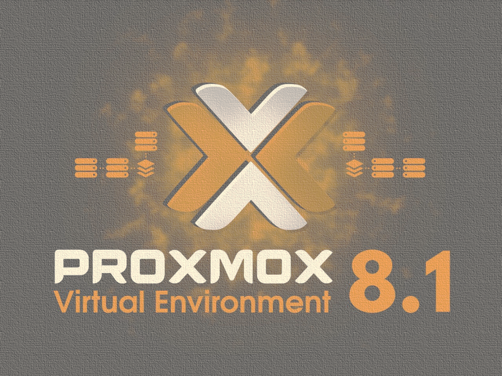
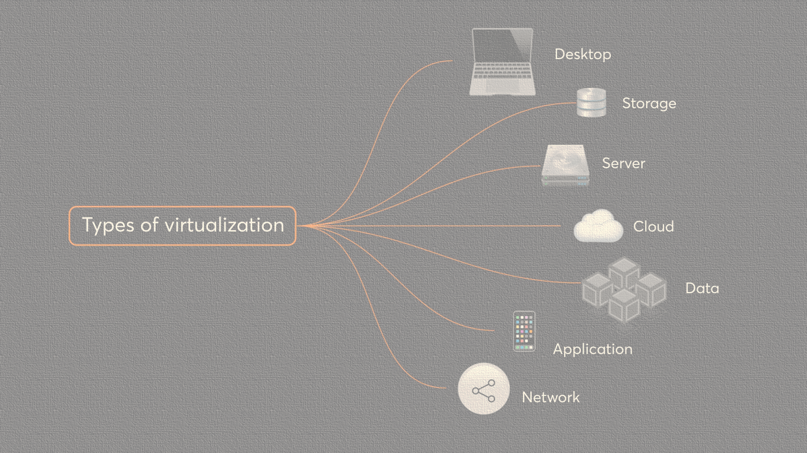
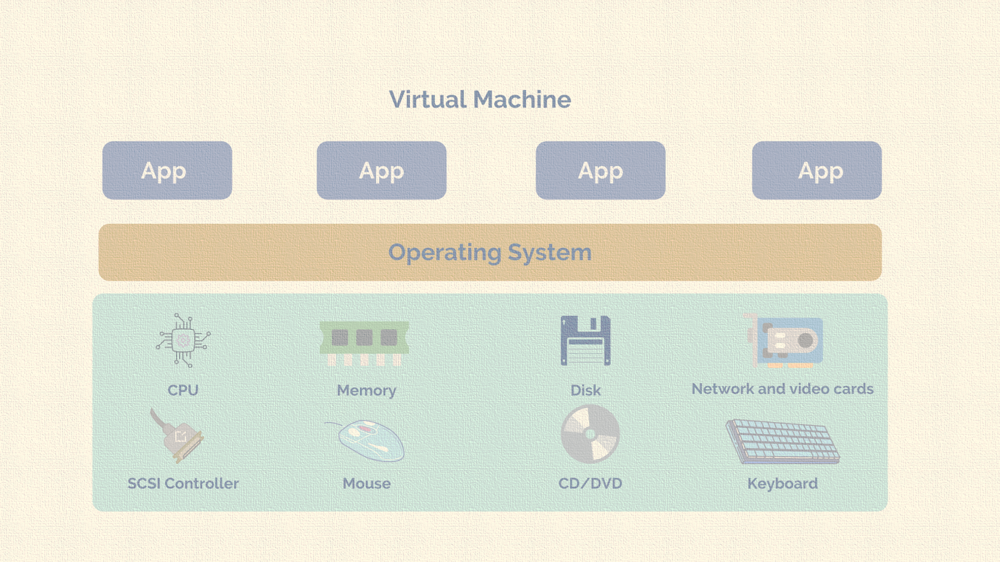
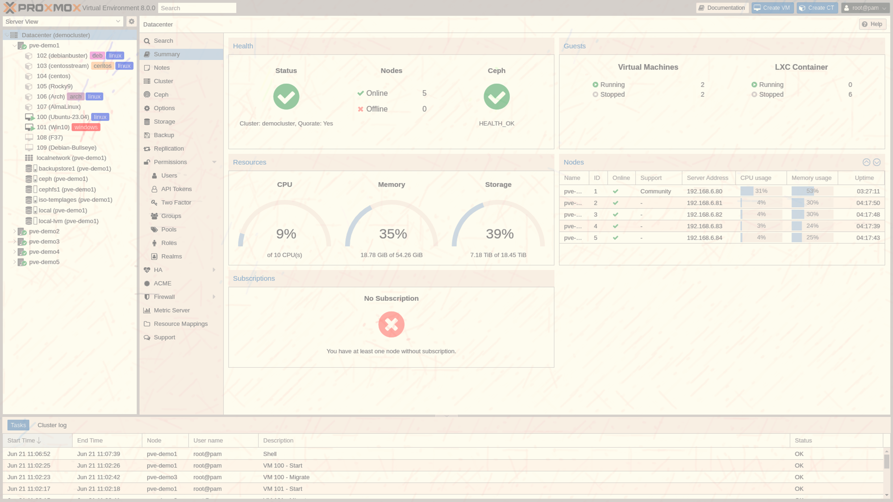
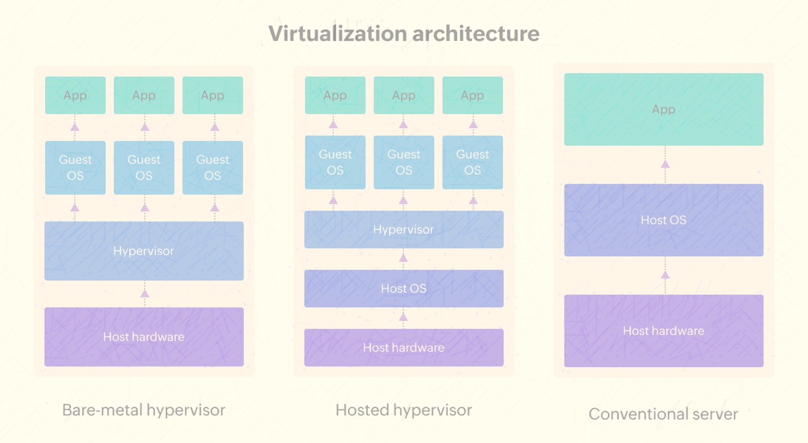
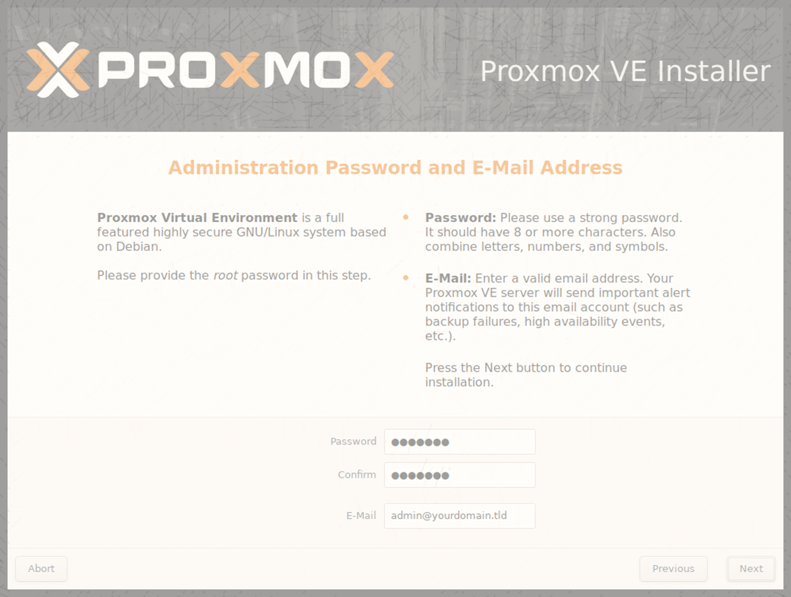

Udemy Course >> Proxmox VE 8 KVM Virtualization and Ceph Storage HA Cluster

How to Install Configure Proxmox VE 8 KVM Virtualization + Ceph Storage Linux HA Cluster Deployment

**********

Tips/Tricks/Notes/Commands URL Link: 
https://github.com/nimaxnimax/Udemy_Virtualization

Instructor & Courses >> 
https://www.udemy.com/user/adrian-fischer-infotech/

**********

Proxmox VE

- Proxmox VE (Virtual Environment) is an open-source virtualization management platform.
- It integrates KVM (Kernel-based Virtual Machine) and LXC (Linux Containers) for virtualization.
- Offers a web-based interface for easy management of virtual machines and containers.
- Provides features like live migration, high availability clustering, and backup and restore capabilities.
- Supports various storage options including local storage, NFS, iSCSI, and Ceph Storage.
- Enables users to build resilient virtualization infrastructures for both small-scale and enterprise environments.
- Allows for the creation of highly available virtualization clusters.
- Offers comprehensive monitoring and reporting tools for resource utilization and performance analysis.
- Continuously updated with new features and improvements by the Proxmox team and the open-source community.
- Suitable for various use cases including server consolidation, development and testing environments, and cloud computing.

**********

Proxmox VE Advantages

- **Cost-effective**: Proxmox VE is an open-source platform, which means it's free to use. This makes it a cost-effective solution for businesses looking to implement virtualization without investing in expensive proprietary software.

- **Integrated solution**: Proxmox VE integrates both KVM virtualization and LXC containerization into a single platform. This provides users with flexibility in choosing the virtualization method that best suits their needs, whether it's full hardware virtualization with KVM or lightweight containerization with LXC.

- **User-friendly interface**: Proxmox VE offers a web-based management interface that is intuitive and easy to use. This makes it accessible to users with varying levels of technical expertise, from beginners to experienced sysadmins.

- **High availability**: Proxmox VE supports high availability clustering, allowing users to create clusters of multiple Proxmox VE nodes. This ensures that if one node fails, VMs and containers can be automatically migrated to other nodes, minimizing downtime and ensuring continuous operation.

- **Live migration**: Proxmox VE supports live migration, which allows users to move running VMs and containers between Proxmox VE nodes without any interruption in service. This is particularly useful for load balancing, maintenance, and avoiding downtime during hardware upgrades.

- **Backup and restore**: Proxmox VE includes built-in backup and restore capabilities, making it easy to create and manage backups of VMs and containers. This helps ensure data integrity and provides a safety net in case of hardware failures or other disasters.

- **Scalability**: Proxmox VE is highly scalable and can easily grow with your business. Whether you're running a small cluster of a few nodes or a large-scale deployment with dozens of nodes, Proxmox VE can accommodate your needs.

- **Community support**: Proxmox VE has a large and active community of users and developers who contribute to its ongoing development and provide support through forums, mailing lists, and other channels. This means you can get help and advice from fellow users and experts in the community.

- **Security**: Proxmox VE takes security seriously and includes features such as role-based access control (RBAC), firewall integration, and secure communication protocols to help protect your virtualization infrastructure from unauthorized access and attacks.

**********

Proxmox VE Disadvantages

While Proxmox VE offers many advantages, there are also some potential disadvantages to consider:

- **Learning curve**: While Proxmox VE strives to be user-friendly, there can still be a learning curve, especially for users who are new to virtualization or Linux-based systems. Setting up and configuring Proxmox VE, as well as understanding its various features and capabilities, may require some time and effort.

- **Hardware compatibility**: Proxmox VE's compatibility with certain hardware components, especially newer or less common hardware, may vary. Users may encounter issues with hardware drivers or compatibility issues that require additional troubleshooting or workarounds.

- **Limited official support**: While Proxmox VE has a vibrant community of users and developers who provide support through forums and other channels, there is limited official support available compared to proprietary virtualization solutions. Businesses that require guaranteed support and service-level agreements (SLAs) may need to consider purchasing commercial support from Proxmox or third-party vendors.

- **Resource overhead**: Running a virtualization platform like Proxmox VE requires additional resources compared to running applications directly on bare metal. Users may need to allocate more RAM, CPU, and storage resources to host the Proxmox VE environment and the virtual machines and containers it manages.

- **Complexity of clustering**: While Proxmox VE supports high availability clustering, setting up and managing a clustered environment can be complex, especially for users with limited experience in clustering technologies. Ensuring proper configuration, fault tolerance, and failover mechanisms may require careful planning and ongoing maintenance.

- **Lack of enterprise features**: While Proxmox VE offers many features found in enterprise-grade virtualization solutions, such as live migration, high availability, and backup and restore capabilities, it may lack some advanced features or integrations found in proprietary solutions. Businesses with specific requirements or dependencies on proprietary features may find Proxmox VE's feature set to be lacking in certain areas.

While Proxmox VE offers a powerful and flexible virtualization platform with many advantages, potential users should carefully consider these disadvantages and assess whether Proxmox VE meets their specific needs and requirements.

**********

Licensing of Proxmox VE

- **Open-source license**: Proxmox VE is distributed under the GNU Affero General Public License, version 3 (GNU AGPLv3). This means that it is open-source software, and users have the freedom to use, modify, and distribute the software according to the terms of the license.

- **Free to use**: Proxmox VE is free to download, use, and distribute. There are no licensing fees or costs associated with using Proxmox VE, making it an attractive option for businesses and individuals looking for a cost-effective virtualization solution.

- **No mandatory subscription**: While Proxmox offers subscription-based support services and additional features through their Proxmox VE Subscription program, there is no requirement to purchase a subscription to use Proxmox VE. Users can choose to use the free, community-supported version of Proxmox VE without purchasing a subscription.

- **Subscription benefits**: Users who purchase a Proxmox VE Subscription gain access to additional features and benefits, including access to the Proxmox VE Enterprise Repository for automatic updates and access to enterprise support services, including technical support and software updates.

- **Subscription pricing**: Proxmox VE Subscription pricing is based on a per-socket basis, with different tiers available depending on the level of support and features required. Pricing is transparent and published on the Proxmox website, making it easy for users to understand the costs associated with purchasing a subscription.

- **Optional support services**: While Proxmox VE is community-supported and users can get help and assistance from the Proxmox community forums and other channels, businesses that require guaranteed support and service-level agreements (SLAs) can purchase commercial support services from Proxmox or third-party vendors.

Proxmox VE offers users the flexibility to choose between using the free, community-supported version or purchasing a subscription for access to additional features and support services, depending on their needs and requirements.

**********

Comparison of Proxmox VE Virtualization with XenServer Hyper-V VMware ESXi

Proxmox VE:
- Open-source platform based on KVM virtualization and LXC containerization.
- Provides a unified web-based interface for managing both virtual machines and containers.
- Offers features like live migration, high availability clustering, and backup and restore capabilities.
- Suitable for small to large-scale deployments and supports various storage options including local storage, NFS, iSCSI, and Ceph Storage.
- Community-supported with optional subscription-based support services available.
- Cost-effective solution with no licensing fees for the core platform.

XenServer:
- Based on the Xen hypervisor.
- Offers features like live migration, high availability, and centralized management through XenCenter.
- Developed by Citrix and offers integration with other Citrix products like Citrix Virtual Apps and Desktops (formerly XenApp and XenDesktop).
- Supports multiple storage options and networking configurations.
- Offers both free and commercial editions with additional features and support services available for the commercial version.

Hyper-V:
- Developed by Microsoft and integrated into Windows Server.
- Offers features like live migration, failover clustering, and Hyper-V Replica for disaster recovery.
- Provides integration with other Microsoft products like System Center Virtual Machine Manager (SCVMM) for centralized management.
- Supports various storage options including direct-attached storage (DAS), storage area network (SAN), and network-attached storage (NAS).
- Available as a standalone hypervisor or as part of Windows Server licensing.

VMware ESXi:
- Developed by VMware and part of the VMware vSphere suite.
- Offers features like vMotion, High Availability (HA), and Distributed Resource Scheduler (DRS) for workload balancing.
- Provides centralized management through VMware vCenter Server.
- Supports various storage options including VMware vSAN, Fibre Channel, iSCSI, and NFS.
- Known for its robustness, performance, and extensive ecosystem of third-party integrations.
- Available in both free and commercial editions, with the commercial version offering additional features and support services.

The choice between Proxmox VE, XenServer, Hyper-V, and VMware ESXi depends on factors such as specific requirements, budget, familiarity with the platform, and integration with existing infrastructure and tools. Each platform has its own strengths and weaknesses, so it's essential to evaluate them based on individual needs and preferences.

**********

Main ports and protocols used by Proxmox VE

- **HTTP/HTTPS**: 
  - Default Ports: 8006 (HTTPS), 8006 (HTTP)
  - Protocol: Web-based management interface accessible via HTTPS (secure) or HTTP (unsecure). Used for accessing the Proxmox VE web interface for administration and management purposes.

- **SSH**:
  - Default Port: 22
  - Protocol: Secure Shell (SSH) protocol for remote access to the Proxmox VE server's command-line interface (CLI). Used for administration and troubleshooting tasks.

- **VNC**:
  - Default Ports: 5900-5999
  - Protocol: Virtual Network Computing (VNC) protocol for remote graphical console access to virtual machines and containers running on Proxmox VE. Each VM or container has its own unique VNC port.

- **NFS**:
  - Default Port: 2049
  - Protocol: Network File System (NFS) protocol used for sharing storage volumes between Proxmox VE nodes or with external storage servers. Used for data storage and sharing purposes.

- **iSCSI**:
  - Default Port: 3260
  - Protocol: Internet Small Computer System Interface (iSCSI) protocol used for accessing block-level storage volumes over TCP/IP networks. Used for connecting Proxmox VE nodes to iSCSI storage targets.

- **Ceph**:
  - Default Ports: 
    - RADOS Gateway (RGW): 7480 (HTTP), 7481 (HTTPS)
    - Ceph Monitor (MON): 6789
    - Ceph OSD (Object Storage Daemon): 6800-7300
  - Protocol: Ports used by the Ceph storage cluster components for communication and data transfer. Proxmox VE integrates with Ceph for scalable and distributed storage.

These ports and protocols are essential for managing and accessing various aspects of a Proxmox VE deployment, including the web-based management interface, remote access, virtual machine/console access, storage connectivity, and integration with external storage solutions like Ceph. It's crucial to ensure proper firewall and network configuration to allow communication on these ports as needed for the intended functionality of Proxmox VE.

**********

Requirements

Minimum requirements to install Proxmox VE:

- **Hardware Requirements**:
  - x86-64 compatible CPU (Intel or AMD).
  - Minimum of 2 CPU cores (additional cores recommended for better performance).
  - Minimum of 4 GB RAM (additional RAM recommended for running VMs and containers).
  - Sufficient disk space for the Proxmox VE installation (at least 32 GB).
  - Network interface card (NIC) for network connectivity.

- **Software Requirements**:
  - Compatible storage device for installing Proxmox VE (e.g., SSD, HDD).
  - Installation media for Proxmox VE (ISO image).
  - Optionally, a network connection for downloading updates and accessing repositories during installation.

- **System Compatibility**:
  - Verify hardware compatibility with Proxmox VE by checking the Hardware Compatibility List (HCL) provided by Proxmox or consulting community resources.
  - Ensure compatibility with any additional hardware components or peripherals required for specific use cases (e.g., RAID controllers, network adapters).

- **Network Configuration**:
  - Configure network settings (IP address, subnet mask, gateway) appropriate for your network environment.
  - Ensure proper DNS configuration for resolving hostnames and accessing external resources if required.

- **Installation Media**:
  - Download the latest version of the Proxmox VE ISO image from the official Proxmox website.
  - Burn the ISO image to a CD/DVD or create a bootable USB drive for installation.

- **Installation Process**:
  - Boot the server from the Proxmox VE installation media.
  - Follow the on-screen prompts to select installation options, configure disk partitions, and complete the installation process.
  - Set up a root password and configure basic network settings during the installation.
  - Optionally, configure additional settings such as storage, networking, and clustering after the installation is complete.

These minimum requirements are essential for installing and running Proxmox VE on a physical server. However, it's recommended to review the official documentation and consider additional resources based on your specific use case and performance requirements.

**********

Ceph Storage

- **Distributed Storage**: Ceph is a distributed storage system designed for scalability, reliability, and performance. It distributes data across multiple nodes in a cluster, providing fault tolerance and high availability.

- **Object Storage**: Ceph provides object storage capabilities, allowing users to store and retrieve large amounts of unstructured data, such as images, videos, and documents, using a RESTful interface.

- **Block Storage**: Ceph also offers block storage functionality, enabling users to create and manage virtual block devices (RBDs) that can be used as storage for virtual machines and other applications. RBDs provide features like snapshots, cloning, and thin provisioning.

- **File System**: Ceph File System (CephFS) provides a POSIX-compliant distributed file system that can be mounted on multiple clients simultaneously. It offers features like file-level snapshots, data replication, and scalability.

- **RADOS**: Ceph's underlying storage layer is known as Reliable Autonomic Distributed Object Store (RADOS). It is responsible for managing the storage and replication of objects across the cluster, ensuring data durability and consistency.

- **Scalability**: Ceph is highly scalable and can scale from a few nodes to thousands of nodes seamlessly. New nodes can be added to the cluster without downtime, allowing the storage infrastructure to grow with the needs of the organization.

- **Fault Tolerance**: Ceph provides fault tolerance by replicating data across multiple nodes in the cluster. If a node fails, Ceph automatically redistributes data to ensure data availability and integrity.

- **Self-Healing**: Ceph has self-healing capabilities that detect and repair data inconsistencies or failures automatically. It continuously monitors the health of the cluster and takes corrective actions to maintain data reliability.

- **Open Source**: Ceph is open-source software distributed under the terms of the GNU Lesser General Public License (LGPL). This allows users to access the source code, modify it, and contribute back to the community.

- **Integration**: Ceph integrates seamlessly with various virtualization platforms, including Proxmox VE, OpenStack, and Kubernetes, making it an ideal choice for building scalable and reliable storage infrastructures for cloud and virtualized environments.

**********

Advantages of using Ceph as a storage solution

- **Scalability**: Ceph is highly scalable and can scale from small clusters to large-scale deployments seamlessly. It can accommodate the growth of data storage needs without downtime or disruption, making it suitable for organizations of all sizes.

- **Distributed Architecture**: Ceph's distributed architecture ensures high availability and fault tolerance. Data is distributed across multiple nodes in the cluster, and replicas are created to ensure data redundancy. This architecture minimizes the risk of data loss and downtime due to hardware failures.

- **Cost-Effectiveness**: Ceph is built using commodity hardware, which makes it a cost-effective storage solution compared to proprietary storage systems. Organizations can leverage low-cost hardware components to build scalable and reliable storage infrastructures.

- **Flexibility**: Ceph offers support for multiple storage interfaces, including object storage, block storage, and file storage. This flexibility allows users to choose the storage interface that best fits their application requirements, making Ceph suitable for a wide range of use cases.

- **Self-Healing**: Ceph has self-healing capabilities that detect and repair data inconsistencies or failures automatically. It continuously monitors the health of the cluster and takes corrective actions to maintain data reliability, reducing the need for manual intervention.

- **Open Source**: Ceph is an open-source project with a large and active community of developers and users. This means that users have access to the source code, can modify it to suit their needs, and contribute back to the community. The open-source nature of Ceph also ensures transparency and reduces vendor lock-in.

- **Integration**: Ceph integrates seamlessly with popular virtualization and cloud platforms, including Proxmox VE, OpenStack, and Kubernetes. This makes it an ideal choice for building storage infrastructures for virtualized environments and cloud deployments.

- **Performance**: Ceph is designed for high-performance storage workloads and can deliver high throughput and low latency. It utilizes techniques such as data striping and parallelization to maximize performance across the cluster, ensuring optimal storage performance for demanding applications.

- **Data Consistency**: Ceph ensures data consistency and integrity through features such as data checksums and replication. Data is verified for integrity during storage and transmission, reducing the risk of data corruption and ensuring data reliability.

**********

KVM (Kernel-based Virtual Machine) virtualization

- **Hypervisor**: KVM is a type-1 hypervisor, which means it runs directly on the host system's hardware without the need for a separate underlying operating system. This provides better performance and resource utilization compared to type-2 hypervisors.

- **Kernel Integration**: KVM is integrated into the Linux kernel, which allows it to leverage the kernel's features and optimizations for virtualization. This tight integration ensures efficient resource management and performance.

- **Full Virtualization**: KVM provides full hardware virtualization capabilities, allowing multiple guest operating systems (OSes) to run simultaneously on a single physical host. Each guest OS is isolated from the others and has its own virtual CPU, memory, and I/O devices.

- **Performance**: KVM offers near-native performance for virtualized workloads by leveraging hardware-assisted virtualization features such as Intel VT-x and AMD-V. This minimizes the overhead of virtualization and ensures efficient utilization of CPU resources.

- **Compatibility**: KVM supports a wide range of guest operating systems, including Linux, Windows, and various Unix-like operating systems. It can run both 32-bit and 64-bit guest OSes without modification.

- **Live Migration**: KVM supports live migration, allowing virtual machines to be moved between physical hosts with minimal downtime. This enables workload balancing, maintenance, and disaster recovery without interrupting service availability.

- **Management Tools**: KVM can be managed using various management tools, including command-line utilities like virsh and graphical user interfaces (GUIs) such as Virt Manager and oVirt. These tools provide administrators with control over virtual machine management, configuration, and monitoring.

- **Security**: KVM benefits from the security features of the Linux kernel, including mandatory access control (MAC) frameworks like SELinux and AppArmor. This enhances the security of virtualized environments by enforcing access controls and isolating guest OSes from each other and the host system.

- **Open Source**: KVM is an open-source project and is part of the Linux kernel. This means that it is freely available, and users have access to the source code, allowing them to customize and extend its functionality as needed.

- **Community Support**: KVM has a large and active community of developers and users who contribute to its ongoing development and provide support through forums, mailing lists, and other channels. This vibrant community ensures that KVM remains up-to-date and well-supported.

**********

Proxmox VE works with KVM and Ceph storage

- **KVM Integration**:
  - Proxmox VE utilizes KVM (Kernel-based Virtual Machine) as its primary hypervisor for hardware virtualization.
  - KVM provides full virtualization capabilities, allowing Proxmox VE to run multiple virtual machines (VMs) concurrently on a single physical host.
  - Proxmox VE leverages KVM's performance and resource management features to ensure efficient utilization of CPU, memory, and I/O resources.

- **Ceph Storage Integration**:
  - Proxmox VE seamlessly integrates with Ceph Storage, a distributed storage solution, for scalable and resilient storage infrastructure.
  - Ceph Storage is used as a backend storage solution for storing virtual machine disks (RBD - RADOS Block Device) and other data.
  - Proxmox VE supports Ceph for both VM storage and as a storage backend for Proxmox VE itself, enabling high availability and fault tolerance.
  - Ceph integration allows Proxmox VE to take advantage of Ceph's features such as data replication, self-healing, and scalability, ensuring data integrity and availability.

- **Unified Management Interface**:
  - Proxmox VE provides a unified web-based management interface for managing both KVM virtual machines and Ceph storage.
  - Administrators can easily configure, deploy, and manage virtual machines and storage resources through the Proxmox VE web interface.
  - Integration with Ceph Storage is seamless, with options to create and manage Ceph storage pools, monitor cluster health, and allocate storage resources to virtual machines.

- **High Availability and Redundancy**:
  - By combining KVM virtualization with Ceph storage, Proxmox VE can create highly available and redundant virtualization clusters.
  - VMs hosted on Proxmox VE can benefit from Ceph's data redundancy and self-healing capabilities, ensuring minimal downtime and data loss in the event of hardware failures.
  - Proxmox VE supports live migration and automatic failover of VMs between physical hosts, further enhancing availability and resilience.

- **Scalability and Performance**:
  - The combination of KVM virtualization and Ceph storage allows Proxmox VE to scale seamlessly to meet growing demands for virtualization and storage resources.
  - Ceph's distributed architecture enables linear scalability, allowing Proxmox VE clusters to grow from small deployments to large-scale infrastructures without performance degradation.
  - Proxmox VE leverages Ceph's performance optimizations and parallel processing capabilities to deliver high-performance storage solutions for virtualized environments.

**********

How to Download and Install Proxmox VE?

URL >> https://www.proxmox.com/en/

URL >> https://www.proxmox.com/en/downloads

Download >> https://enterprise.proxmox.com/iso/proxmox-ve_8.1-2.iso

Installation options for Proxmox VE on both bare metal or dedicated servers and VMware Player or Workstation for setting up a test lab:

Bare Metal or Dedicated Server Installation:

- **Download Proxmox VE ISO**: Obtain the latest Proxmox VE ISO image from the official Proxmox website.

- **Prepare Installation Media**: Create a bootable USB drive or burn the ISO image to a CD/DVD.

- **Boot from Installation Media**: Insert the bootable USB drive or CD/DVD into the target server and boot from it.

- **Follow Installation Wizard**: Follow the on-screen prompts to install Proxmox VE. You'll need to select installation options, configure disk partitions, set up networking, and create a root password.

- **Complete Installation**: Once the installation process is complete, remove the installation media and reboot the server. Proxmox VE will be ready for configuration and use.

VMware Player or Workstation Test Lab Installation:

- **Download Proxmox VE ISO**: Download the Proxmox VE ISO image from the official Proxmox website.

- **Install VMware Player or Workstation**: If you haven't already, install VMware Player or Workstation on your host machine.

- **Create New Virtual Machine**: Open VMware Player or Workstation and create a new virtual machine. Choose "Linux" as the guest operating system and select "Other Linux 5.x or later kernel 64-bit" as the version.

- **Configure Virtual Machine Settings**: Allocate sufficient resources (CPU, RAM, disk space) to the virtual machine based on your testing requirements. Also, attach the Proxmox VE ISO image to the virtual CD/DVD drive.

- **Start Virtual Machine**: Power on the virtual machine to boot from the Proxmox VE ISO image.

- **Follow Installation Wizard**: Follow the on-screen prompts to install Proxmox VE within the virtual machine. You'll need to select installation options, configure disk partitions, set up networking, and create a root password.

- **Complete Installation**: Once the installation process is complete, reboot the virtual machine. Proxmox VE will be installed and ready to use within the VMware Player or Workstation environment.

By following these steps, you can install Proxmox VE either directly on a bare metal or dedicated server for production use or within a virtualized environment using VMware Player or Workstation for testing and development purposes.

**********

