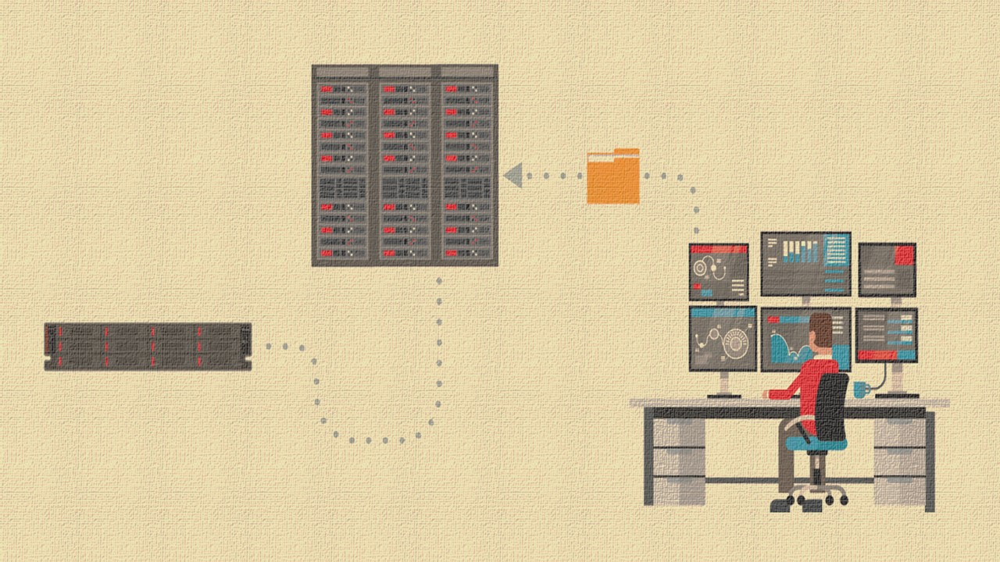

Udemy Course >> Proxmox VE 8 KVM Virtualization and Ceph Storage HA Cluster

How to Install Configure Proxmox VE 8 KVM Virtualization + Ceph Storage Linux HA Cluster Deployment

**********

Tips/Tricks/Notes/Commands URL Link: 
https://github.com/nimaxnimax/Udemy_Virtualization

Instructor & Courses >> 
https://www.udemy.com/user/adrian-fischer-infotech/

**********

