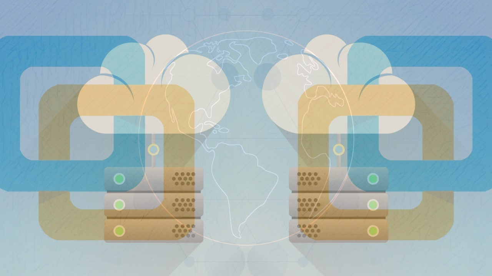

VMware Workstation Player vs Pro: Mastering Virtualization

Explore VMware Workstation - Virtualization Mastery: Building Virtual Machines to Advanced Virtual Machine Management

Tips/Tricks/Notes/Commands URL Link >> https://github.com/nimaxnimax/Udemy_Virtualization

Instructor & Courses >> https://www.udemy.com/user/adrian-fischer-infotech/

Welcome to "VMware Workstation Player vs Pro: Mastering Virtualization," a comprehensive course designed to equip you with the knowledge and skills to effectively use VMware Workstation for all your virtualization needs. In this course, you'll learn the key differences between VMware Workstation Player and Pro, and how to leverage each version's features for optimal performance. Starting with the basics of virtualization, we'll guide you through the installation and setup processes, followed by in-depth tutorials on creating, configuring, and managing virtual machines. You'll explore advanced features such as virtual network simulation and encrypted VM protection, and learn best practices for using virtual machines in development, testing, and production environments. By the end of this course, you'll be proficient in using VMware Workstation to create efficient, isolated environments that enhance your software development and testing workflows.

**Course Title: VMware Workstation Player vs Pro: Mastering Virtualization**

**Course Description:**

Welcome to "VMware Workstation Player vs Pro: Mastering Virtualization," a comprehensive course designed to help you understand the differences between VMware Workstation Player and Pro, and how to leverage these tools for effective virtualization.

VMware Workstation is a powerful suite of desktop hypervisor applications that enable users to run multiple operating systems on a single physical machine. It is available in two versions: VMware Workstation Player, a free basic version for personal use, and VMware Workstation Pro, a premium version with advanced features for power users and professionals.

**Why Use VMware Workstation?**
VMware Workstation is essential for anyone looking to create and manage virtual machines efficiently. It allows you to:
- Run multiple operating systems simultaneously on a single PC without rebooting.
- Test software on different OS configurations without needing multiple physical machines.
- Isolate environments to prevent system crashes and maintain stability during software testing.

**Advantages of Using VMware Workstation:**
- **Cost Efficiency:** Reduce hardware costs by running multiple virtual machines on a single physical device.
- **Convenience:** Quickly switch between different OS environments without rebooting.
- **Enhanced Testing:** Perform software development and testing in isolated environments, minimizing the risk of damaging the host system.
- **Snapshot and Cloning:** Easily create snapshots and clones of virtual machines for backup and replication purposes.
- **Advanced Features (Pro):** Utilize additional features like virtual network simulation, remote connection to virtual machines, and encrypted VM protection with VMware Workstation Pro.

**Why Use Virtual Machines?**
Virtual machines (VMs) revolutionize the way you use and manage software and operating systems:
- **Isolation:** Keep different environments separate to enhance security and stability.
- **Flexibility:** Test and deploy multiple applications across various operating systems without the need for additional hardware.
- **Disaster Recovery:** Quickly restore systems to previous states using VM snapshots.
- **Development and Testing:** Create versatile development and testing environments that can mimic production settings.

In this course, you'll gain hands-on experience with both VMware Workstation Player and Pro, learning how to build, configure, and manage virtual machines effectively. Whether you're a beginner looking to understand the basics or a professional seeking to deepen your virtualization expertise, this course provides the knowledge and skills you need to master VMware Workstation and virtualization.

**What Students Will Learn in This Course:**

1. **Introduction to Virtualization:**
   - Understanding the basics of virtualization and its importance in modern computing.
   - Differences between physical and virtual machines.

2. **VMware Workstation Overview:**
   - Detailed introduction to VMware Workstation Player and VMware Workstation Pro.
   - Key features and functionalities of each version.

3. **Installing and Setting Up VMware Workstation:**
   - Step-by-step guide to installing VMware Workstation on different operating systems.
   - Initial configuration and setup of VMware Workstation.

4. **Creating and Configuring Virtual Machines:**
   - How to create a new virtual machine from scratch.
   - Configuring virtual machine settings including CPU, memory, disk space, and network.

5. **Managing Virtual Machines:**
   - Best practices for starting, pausing, and stopping virtual machines.
   - Managing snapshots and clones for efficient VM management.

6. **Advanced Features of VMware Workstation Pro:**
   - Exploring advanced features such as virtual network simulation and encrypted VM protection.
   - Remote connection and management of virtual machines.

7. **Using Virtual Machines for Development and Testing:**
   - Setting up isolated environments for software development and testing.
   - Using virtual machines to test different OS configurations and software setups.

8. **Backup and Recovery:**
   - Techniques for creating backups of virtual machines.
   - Restoring virtual machines from snapshots and clones.

9. **Performance Optimization:**
   - Tips and tricks for optimizing the performance of your virtual machines.
   - Managing resource allocation to ensure efficient VM operation.

10. **Real-World Applications and Use Cases:**
    - Practical examples of how virtualization is used in industry settings.
    - Case studies highlighting the benefits of using VMware Workstation in various scenarios.

By the end of this course, students will have a comprehensive understanding of VMware Workstation, the skills to create and manage virtual machines effectively, and the knowledge to utilize virtualization to enhance their development, testing, and operational workflows.

To successfully complete this course, you need a basic understanding of fundamental computer operations and familiarity with operating systems like Windows, Linux, or macOS. Your computer should have at least 4GB of RAM (8GB or more recommended), a multi-core processor (such as Intel i3, i5, i7, or equivalent), and a minimum of 10GB of free disk space, with more recommended for multiple virtual machines. You'll also need VMware Workstation Player or VMware Workstation Pro, as well as installation media for the operating systems you plan to virtualize (ISO files, installation discs, etc.). A reliable internet connection is necessary for downloading software, updates, and accessing online resources, and you must have administrative privileges on your computer to install and configure the required software.

**Who Should Learn This Course:**

1. **IT Professionals:**
   - System administrators, network engineers, and IT support staff looking to enhance their virtualization skills and manage virtual environments more effectively.

2. **Software Developers and Testers:**
   - Developers and QA testers interested in creating, testing, and deploying applications across different operating system environments without the need for additional physical hardware.

3. **Students and Enthusiasts:**
   - Computer science students and technology enthusiasts eager to explore virtualization technology, understand its practical applications, and gain hands-on experience with VMware Workstation.

4. **Tech Enthusiasts and Hobbyists:**
   - Individuals interested in setting up virtual machines for personal projects, experimenting with different operating systems, or exploring new software configurations in a safe and isolated environment.

5. **Business Professionals:**
   - Managers and professionals needing to grasp virtualization concepts to optimize IT infrastructure, reduce hardware costs, and improve operational efficiency within their organizations.

6. **Consultants and Freelancers:**
   - Independent IT consultants and freelancers seeking to broaden their expertise in virtualization, offering valuable services and solutions to clients across various industries.

7. **Cybersecurity Professionals:**
   - Security analysts and cybersecurity professionals interested in leveraging virtualization for secure software testing, malware analysis, and creating isolated environments for sensitive operations.

8. **Educators and Trainers:**
   - Teachers and trainers in technology fields looking to integrate virtualization education into their curriculum, preparing students for real-world IT environments and certifications.

9. **Small Business Owners:**
   - Entrepreneurs and small business owners aiming to maximize resource utilization, enhance data security, and streamline IT operations through virtualization technologies.

10. **Remote Workers:**
    - Individuals transitioning to remote work environments who need to manage virtual machines for job-related tasks, ensuring productivity and flexibility while maintaining system integrity.

This course is suitable for anyone looking to gain practical skills in virtualization using VMware Workstation, regardless of their professional background or current role in technology.

